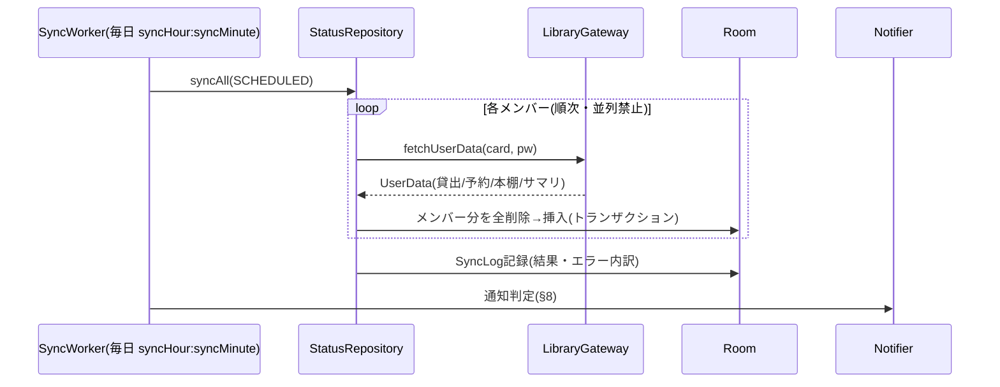

# バックエンド設計書

対象: 西宮市立図書館 家族用アプリ(Android)のデータ層
前提資料: [仕様書](spec.md) / [サイト調査結果](site-research.md)
最終更新: 2026-07-17

UIは本書のスコープ外(バックエンド完成後に別途設計)。ただしUIから使う公開API
(リポジトリ層のインターフェース)は本書で確定させる。

## 1. 技術スタックとプロジェクト設定

| 項目 | 選定 | バージョン |
|---|---|---|
| 言語 | Kotlin | 2.0.21 |
| ビルド | Gradle (Version Catalog) / AGP | Gradle 8.14.3 / AGP 8.7.3 |
| minSdk / targetSdk | 26 / 35 | |
| HTTP | OkHttp | 4.12.0 |
| HTMLパース | Jsoup | 1.18.1 |
| JSON | kotlinx-serialization-json | 1.7.3 |
| ローカルDB | Room (KSP) | 2.6.1 |
| 設定保存 | DataStore Preferences | 1.1.1 |
| 認証情報保存 | EncryptedSharedPreferences (security-crypto) | 1.1.0-alpha06 |
| バックグラウンド | WorkManager | 2.9.1 |
| 画像 | Coil (UI実装時。メモリキャッシュのみで使用) | 2.7.0 |
| DI | Hilt | 2.52 |
| テスト | JUnit4 + kotlinx-coroutines-test + Robolectric(Room用) | |

- パッケージ名: `com.fallgist.nishinomiyalibrary`
- 単一モジュール(`:app`)構成。パッケージ分割で層を分ける(家族用アプリに
  マルチモジュールは過剰)

```
com.fallgist.nishinomiyalibrary/
├── domain/model/        # ドメインモデル(純Kotlin、Android非依存)
├── data/
│   ├── remote/          # LICS-XPクライアント + パーサ + openBDクライアント
│   │   ├── licsxp/
│   │   │   ├── LicsXpClient.kt
│   │   │   ├── LicsXpSession.kt
│   │   │   └── parser/  # 1画面=1パーサ
│   │   └── openbd/
│   ├── local/           # Room(entity/dao/db) + CredentialStore + 設定
│   ├── repository/      # UI向け公開API(本書§6)
│   └── sync/            # WorkManager同期 + 通知
└── ui/                  # (後日設計)
```

## 2. ドメインモデル

すべて `domain/model/` に置く純Kotlin data class。日付は `java.time.LocalDate`
(API 26+なのでdesugaring不要)。

```kotlin
data class Member(
    val id: Long,            // アプリ内ID(Room自動採番)
    val name: String,        // 表示名(例: パパ)
    val colorHex: String,    // 識別色 "#RRGGBB"
    val cardNumber: String,  // 図書館カード番号(数字文字列)
    val sortOrder: Int,
)

data class Loan(
    val memberId: Long,
    val title: String,       // 資料名(著者・出版社を含む生文字列も保持)
    val materialType: String, // 児童図書/一般図書/コミック等
    val lendingLibrary: String, // 貸出館名
    val loanDate: LocalDate,
    val dueDate: LocalDate,  // 返却期限日
    val status: String,      // 貸出中 等
)

data class Reservation(
    val memberId: Long,
    val title: String,
    val materialType: String,
    val pickupLibrary: String,   // 受取館(確定前は空)
    val reservedDate: LocalDate,
    val queuePosition: Int?,     // 順位(取置後はnull)
    val state: ReservationState, // WAITING / READY / その他
    val holdExpiryDate: LocalDate?, // 取置期限
)

enum class ReservationState { WAITING, READY, UNKNOWN }

data class ShelfItem(          // マイ本棚
    val memberId: Long,
    val tilcod: String,        // タイトルコード(13桁)
    val title: String,
    val memo: String,
    val registeredDate: LocalDate,
)

data class UserSummary(        // ログイン後ヘッダの利用状況サマリ
    val memberId: Long,
    val shelfCount: Int,
    val loanCount: Int,
    val reservationCount: Int,
    val cartCount: Int,
)

data class SearchHit(
    val tilcod: String,
    val title: String,
    val writerLine: String,    // 「著者／著 出版社 年」の生文字列
    val materialType: String,
)

data class SearchPage(
    val hits: List<SearchHit>,
    val totalCount: Int,
    val hasNext: Boolean,
)

data class BookDetail(
    val tilcod: String,
    val fields: Map<String, String>, // 書名/著者名/出版者/出版年/ISBN等、画面のラベル→値
    val isbn: String?,               // fieldsから正規化して抽出
    val holdings: List<Holding>,
    val holdingCount: Int, val availableCount: Int, val reservationCount: Int,
)

data class Holding(
    val library: String,      // 館名
    val materialType: String,
    val callNumber: String,   // 請求記号
    val location: String,     // 配架場所
    val lendable: String,     // 帯出区分
    val status: String,       // 在庫/貸出中
)

data class Library(val code: String, val name: String)  // §5.5の12施設固定リスト

data class ClosedDay(val libraryCode: String, val date: LocalDate)
```

## 3. LICS-XPクライアント(`data/remote/licsxp/`)

### 3.1 設計方針

- **1同期=1セッション**: 同期のたびにログインし直す。Cookieの永続化はしない
  (`JSESSIONID` はメモリ上のCookieJarのみ)
- **hashフロー**: 画面POSTには直前ページの `hash` と `gamenid` が必要。
  `LicsXpSession` が「最後に取得したページのhash/gamenid」を保持し、次のPOSTに
  自動同送する
- **User-Agent**: ブラウザ相当のUA文字列を必ず送る(ボットUAは403になる)。
  UAは1箇所で定数管理
- **礼儀**: リクエスト間に最低500msのディレイ。リトライは1回まで(指数バックオフ)
- **書き込み拡張**: 予約等を将来追加する場合は `LicsXpClient` にメソッドを
  追加する(既存メソッドは変更しない)。書き込み系は必ず別メソッド・別テストとする

### 3.2 公開インターフェース

```kotlin
interface LibraryGateway {
    // ログイン不要
    suspend fun search(keyword: String, page: Int = 1): SearchPage
    suspend fun autocomplete(keyword: String): List<String>
    suspend fun isLendable(tilcod: String): Boolean?   // null=不明
    suspend fun bookDetail(tilcod: String): BookDetail
    suspend fun closedDays(libraryCode: String): List<LocalDate>

    // 要ログイン: 1回のセッションでまとめて取得
    suspend fun fetchUserData(cardNumber: String, password: String): UserData
}

data class UserData(
    val summary: UserSummary,       // memberIdはリポジトリ層で付与
    val loans: List<Loan>,
    val reservations: List<Reservation>,
    val shelf: List<ShelfItem>,
)
```

### 3.3 エンドポイントとフロー

ベースURL: `https://tosho.nishi.or.jp/licsxp-opac/`
詳細なパラメータは [site-research.md](site-research.md) §2〜§5 が正。要点:

| 操作 | フロー |
|---|---|
| 検索 | ① `GET WOpacEsSchCmpdDispAction.do`(セッション確立) → ② `POST WOpacEsSchCmpdExecAction.do`(`condition1Text` 等) |
| 貸出可否 | `POST getIsLend.do` (`tilcod=`) → JSON `{"isLend":"1"}` |
| 候補 | `GET WOpacEsApiAutoCompleteAction.do?keyword=` → JSON配列 |
| 書誌詳細 | `GET WOpacTifTilListToTifTilDetailAction.do?urlNotFlag=1&tilcod={tilcod}` |
| 休館日 | `GET WOpacMnuTopInitAction.do?WebLinkFlag=1&moveToGamenId=msgcld&loccod={code}` → HTML内JSの `holiday="YYYY-MM-DD"` を正規表現抽出 |
| ログイン | ① ログイン画面GET → ② `POST j_security_check?subSystemFlag=0`、`j_username = "0000000000000000" + カード番号`、`j_password` |
| 利用状況 | ログイン後 ③ `GET WOpacMnuTopInitAction.do?WebLinkFlag=1`(hash取得) → ④ `POST WOpacMnuTopToPwdLibraryAction.do?gamen={usrlend|usrrsv|mybooklist}`(hash/gamenid同送)を3回 |

ログイン成否判定: レスポンスに「ログアウト」リンクがあれば成功、ログイン画面に
戻されたら認証失敗(`AuthException`)。

### 3.4 パーサ(`parser/`)

**1画面=1パーサ**。すべて `(html: String) -> モデル` の純関数オブジェクトで、
Jsoupのみに依存(OkHttpに依存しない)。ユニットテストはフィクスチャHTMLで行う。

| パーサ | 入力画面 | 出力 |
|---|---|---|
| `SearchResultParser` | 検索結果書誌一覧 | `SearchPage`(`div.doc` 単位。§site-research 2参照) |
| `BookDetailParser` | 検索結果書誌詳細 | `BookDetail`(書誌テーブル+所蔵テーブル) |
| `LoanListParser` | 貸出状況一覧 | `List<Loan>` |
| `ReservationListParser` | 予約状況一覧 | `List<Reservation>` |
| `ShelfParser` | マイ本棚 | `List<ShelfItem>` |
| `SummaryParser` | ログイン後共通ヘッダ | `UserSummary` |
| `CalendarParser` | 図書館カレンダー | `List<LocalDate>`(休館日) |
| `HashExtractor` | 全画面 | hash / gamenid |

**パース失敗の扱い**: 期待要素が見つからない場合は `ParseException(screen, reason)`
を投げる。握りつぶし禁止。0件と失敗を区別すること(0件は正常な空リスト)。

日付形式: 貸出系 `yyyy/MM/dd`、予約系 `yy/MM/dd`、本棚 `yyyy/MM/dd`、
カレンダー `yyyy-MM-dd`。パーサ内で `LocalDate` に正規化する。

### 3.5 エラー分類

```kotlin
sealed class LibraryError : Exception() {
    class Network(cause: Throwable) : LibraryError()      // 接続不可・タイムアウト
    class Auth(val memberName: String?) : LibraryError()   // 認証失敗
    class Parse(val screen: String, val detail: String) : LibraryError() // サイト改修疑い
    class Maintenance : LibraryError()                      // メンテナンス画面検知
}
```

Parseエラーは同期結果に記録し、UIで「サイト構造が変わった可能性」を表示できる
ようにする(§7 SyncLog)。

## 4. openBDクライアント(`data/remote/openbd/`)

- `GET https://api.openbd.jp/v1/get?isbn={isbn}` → JSON配列。
  `summary.cover` が表紙URL(空文字あり)
- インターフェース: `suspend fun coverUrl(isbn: String): String?`
- **URLを返すだけ**。画像本体のロードはUI層のCoil(メモリキャッシュのみ、
  `diskCachePolicy(DISABLED)`)が行う。DBにはURLも保存しない(都度解決)

## 5. ローカル層(`data/local/`)

### 5.1 Room

エンティティはドメインモデルとほぼ1:1(`MemberEntity`, `LoanEntity`,
`ReservationEntity`, `ShelfItemEntity`, `ClosedDayEntity`, `SyncLogEntity`,
`UserSummaryEntity`)。ポイント:

- 貸出/予約/本棚は**同期のたびに member 単位で全削除→全挿入**(差分更新はしない。
  件数が高々数十件なので単純さを優先)
- `ReservationEntity` には `firstReadyNotifiedAt: Long?` を持たせ、受取可能通知の
  重複送信を防ぐ(§8.2)
- `ClosedDayEntity` は `(libraryCode, date)` 主キー。取得時に該当館の未来日を
  全削除→挿入
- DBに**パスワードは保存しない**(カード番号はMemberEntityに保存可)

### 5.2 CredentialStore

- `EncryptedSharedPreferences` のラッパー。key=`"pw_member_{memberId}"`
- API: `fun savePassword(memberId: Long, password: String)` /
  `fun getPassword(memberId: Long): String?` / `fun delete(memberId: Long)`
- メンバー削除時に必ず対応するパスワードも削除

### 5.3 設定(DataStore)

| キー | 型 | 既定値 |
|---|---|---|
| `syncHour` / `syncMinute` | Int | 18 / 0 |
| `notifyReturnReminder` | Boolean | true |
| `notifyPickupReady` | Boolean | true |
| `defaultCalendarLibrary` | String | `"106"`(高須分室) |

## 6. リポジトリ層(UIへの公開API)

UIはこの層だけを見る。**読み取りはすべてRoomのFlow**(オフラインでも最終取得
状態が出る)。ネットワークを触るのは `sync()` と検索系のみ。

```kotlin
interface FamilyRepository {
    fun members(): Flow<List<Member>>
    suspend fun addMember(name: String, colorHex: String, cardNumber: String, password: String)
    suspend fun updateMember(member: Member, newPassword: String?)
    suspend fun removeMember(memberId: Long)
}

interface StatusRepository {
    fun loans(): Flow<List<Loan>>                  // 全員分、期限昇順
    fun reservations(): Flow<List<Reservation>>
    fun shelf(memberId: Long): Flow<List<ShelfItem>>
    fun summaries(): Flow<List<UserSummary>>
    fun lastSync(): Flow<SyncLog?>
    suspend fun syncAll(trigger: SyncTrigger): SyncResult  // MANUAL / SCHEDULED
}

interface SearchRepository {                       // キャッシュしない(都度取得)
    suspend fun search(keyword: String, page: Int): SearchPage
    suspend fun autocomplete(keyword: String): List<String>
    suspend fun isLendable(tilcod: String): Boolean?
    suspend fun bookDetail(tilcod: String): BookDetail
    suspend fun coverUrl(isbn: String): String?
}

interface CalendarRepository {
    fun closedDays(libraryCode: String): Flow<List<LocalDate>>
    suspend fun refreshClosedDays(libraryCode: String)
    val libraries: List<Library>                   // 12施設の固定リスト
}
```

`syncAll` は手動更新に**クールダウン(前回成功から5分未満なら再同期しない)**を
入れる。`SyncTrigger.SCHEDULED` はクールダウン対象外。

## 7. 同期フロー(`data/sync/`)



- `PeriodicWorkRequest`(24h)+ `initialDelay` で次の `syncHour:syncMinute` に
  合わせる。時刻設定変更時は `updatePeriodicWork`(REPLACE)で再登録
- 制約: `NetworkType.CONNECTED`。失敗時リトライ: WorkManagerの標準バックオフで
  最大2回、それでも失敗なら `SyncLog` に記録して終了(通知は次回に持ち越し)
- **一部メンバー失敗でも続行**: メンバーごとに成否を `SyncLog.details` に記録

## 8. 通知(`data/sync/Notifier`)

チャンネルは2つ(ユーザーがOS設定でも個別に切れる):
`CH_RETURN_REMINDER`(返却期限) / `CH_PICKUP_READY`(予約受取可能)。
加えてアプリ内設定(§5.3)がfalseなら発火自体を抑止。

### 8.1 返却期限リマインダー(前日・まとめて1通)

- 同期完了後、`dueDate == 明日` の貸出を全員分集計
- 1通に集約: タイトル「明日返却の本があります」、本文「パパ 3冊・長女 2冊」、
  展開でメンバーごとの書名一覧(InboxStyle)
- `dueDate <= 今日`(当日・超過)があれば同じ通知に「期限超過あり」を含める
- 同期が18時に走る前提なので追加のアラームは不要(同期時判定で完結)

### 8.2 予約受取可能(状態遷移検知)

- 同期時、`state == READY` かつ `firstReadyNotifiedAt == null` の予約を集計し、
  1通で通知 → 通知後に `firstReadyNotifiedAt` を記録(重複防止)
- 取置期限(`holdExpiryDate`)があれば本文に含める

## 9. セキュリティ・遵守事項

1. カード番号・パスワードは**このリポジトリ・ログ・例外メッセージに絶対に出さない**
2. パスワードはEncryptedSharedPreferencesのみ。バックアップ対象から除外
   (`android:allowBackup="false"` または backup rules で除外)
3. HTTP通信ログ(OkHttp Interceptor)はデバッグビルドのみ有効化し、
   `j_password` はマスクする
4. アクセス頻度: 自動同期1日1回+手動(クールダウン5分)。リクエスト間500ms
5. 読み取り専用: フォームPOSTは調査済みの参照系画面のみ。予約・延長・変更系の
   URLへは接続しない

## 10. テスト戦略

- **パーサ**: `app/src/test/resources/fixtures/` のHTMLで全パーサをユニットテスト
  (正常系・0件・パース失敗の3系統)。フィクスチャは `scripts/fetch-fixtures.sh`
  で取得し、**個人情報(氏名・カード番号など)を確認のうえコミット**する
  (書名等は家族の合意済みプライベートリポジトリのため可)
- **クライアント**: OkHttpの `MockWebServer` でログイン→hash→POSTフローを検証
- **リポジトリ/DB**: Robolectric + Room in-memory
- **同期・通知判定**: 時計を注入(`Clock`)して前日判定・READY遷移をテスト
- **疎通スモークテスト**(任意実行): 環境変数に認証情報を渡して実サイトに
  1往復するJVMテスト。CIでは実行しない(`@Tag("live")` で分離)
