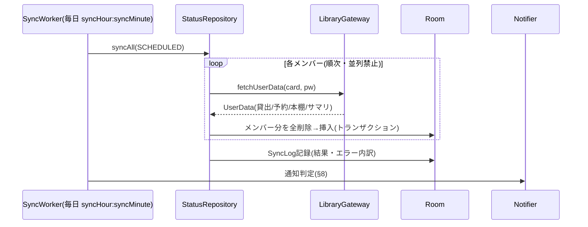
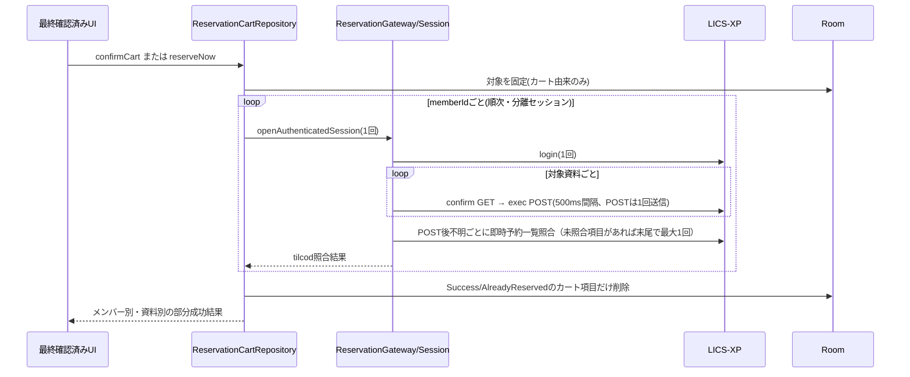

# バックエンド設計書

対象: 西宮市立図書館 家族用アプリ(Android)のデータ層
前提資料: [仕様書](spec.md) / [サイト調査結果](site-research.md)
最終更新: 2026-07-27(予約機能はバックエンド・UIとも実装済み、実サイトでの予約成立を確認済み)

UIの詳細は本書のスコープ外([ui-design.md](ui-design.md)を参照)。ただしUIから使う公開API
(リポジトリ層のインターフェース)は本書で確定させる。

## 1. 技術スタックとプロジェクト設定

| 項目 | 選定 | バージョン |
|---|---|---|
| 言語 | Kotlin | 2.0.21 |
| ビルド | Gradle (Version Catalog) / AGP | Gradle 8.14.3 / AGP 8.7.3 |
| minSdk / targetSdk | 26 / 35 | |
| HTTP | OkHttp | 4.12.0 |
| HTMLパース | Jsoup | 1.18.1 |
| JSON | kotlinx-serialization-json | 1.7.3 |
| ローカルDB | Room (KSP) | 2.6.1 |
| 設定保存 | DataStore Preferences | 1.1.1 |
| 認証情報保存 | EncryptedSharedPreferences (security-crypto) | 1.1.0-alpha06 |
| バックグラウンド | WorkManager | 2.9.1 |
| 画像 | Coil (UI実装時。メモリキャッシュのみで使用) | 2.7.0 |
| DI | Hilt | 2.52 |
| テスト | JUnit4 + kotlinx-coroutines-test + Robolectric(Room用) | |

- パッケージ名: `com.fallgist.nishinomiyalibrary`
- 単一モジュール(`:app`)構成。パッケージ分割で層を分ける(家族用アプリに
  マルチモジュールは過剰)

```
com.fallgist.nishinomiyalibrary/
├── domain/model/        # ドメインモデル(純Kotlin、Android非依存)
├── data/
│   ├── remote/          # LICS-XPクライアント + パーサ + openBDクライアント
│   │   ├── licsxp/
│   │   │   ├── LicsXpClient.kt
│   │   │   ├── LicsXpSession.kt
│   │   │   └── parser/  # 1画面=1パーサ
│   │   └── openbd/
│   ├── local/           # Room(entity/dao/db) + CredentialStore + 設定
│   ├── repository/      # UI向け公開API(本書§6)
│   └── sync/            # WorkManager同期 + 通知
└── ui/                  # (後日設計)
```

## 2. ドメインモデル

すべて `domain/model/` に置く純Kotlin data class。日付は `java.time.LocalDate`
(API 26+なのでdesugaring不要)。

```kotlin
data class Member(
    val id: Long,            // アプリ内ID(Room自動採番)
    val name: String,        // 表示名(例: パパ)
    val colorHex: String,    // 識別色 "#RRGGBB"
    val cardNumber: String,  // 図書館カード番号(数字文字列)
    val sortOrder: Int,
)

data class Loan(
    val memberId: Long,
    val title: String,       // 資料名(著者・出版社を含む生文字列も保持)
    val materialType: String, // 児童図書/一般図書/コミック等
    val lendingLibrary: String, // 貸出館名
    val loanDate: LocalDate,
    val dueDate: LocalDate,  // 返却期限日
    val status: String,      // 貸出中 等
)

data class Reservation(
    val memberId: Long,
    val title: String,
    val materialType: String,
    val pickupLibrary: String,   // 受取館(確定前は空)
    val reservedDate: LocalDate,
    val queuePosition: Int?,     // 順位(取置後はnull)
    val state: ReservationState, // WAITING / READY / その他
    val holdExpiryDate: LocalDate?, // 取置期限
)

enum class ReservationState { WAITING, READY, UNKNOWN }

data class ShelfItem(          // マイ本棚
    val memberId: Long,
    val tilcod: String,        // タイトルコード(13桁)
    val title: String,
    val memo: String,
    val registeredDate: LocalDate,
)

data class UserSummary(        // ログイン後ヘッダの利用状況サマリ
    val memberId: Long,
    val shelfCount: Int,
    val loanCount: Int,
    val reservationCount: Int,
    val cartCount: Int,
)

data class SearchHit(
    val tilcod: String,
    val title: String,
    val writerLine: String,    // 「著者／著 出版社 年」の生文字列
    val materialType: String,
)

data class SearchPage(
    val hits: List<SearchHit>,
    val totalCount: Int,
    val hasNext: Boolean,
)

data class BookDetail(
    val tilcod: String,
    val fields: Map<String, String>, // 書名/著者名/出版者/出版年/ISBN等、画面のラベル→値
    val isbn: String?,               // fieldsから正規化して抽出
    val holdings: List<Holding>,
    val holdingCount: Int, val availableCount: Int, val reservationCount: Int,
)

data class Holding(
    val library: String,      // 館名
    val materialType: String,
    val callNumber: String,   // 請求記号
    val location: String,     // 配架場所
    val lendable: String,     // 帯出区分
    val status: String,       // 在庫/貸出中
)

data class Library(val code: String, val name: String)  // §5.5の12施設固定リスト

data class ClosedDay(val libraryCode: String, val date: LocalDate)
```

## 3. LICS-XPクライアント(`data/remote/licsxp/`)

### 3.1 設計方針

- **1同期=1セッション**: 同期のたびにログインし直す。Cookieの永続化はしない
  (`JSESSIONID` はメモリ上のCookieJarのみ)
- **hashフロー**: 画面POSTには直前ページの `hash` と `gamenid` が必要。
  `LicsXpSession` が「最後に取得したページのhash/gamenid」を保持し、次のPOSTに
  自動同送する
- **User-Agent**: ブラウザ相当のUA文字列を必ず送る(ボットUAは403になる)。
  UAは1箇所で定数管理
- **礼儀**: リクエスト間に最低500msのディレイ。参照系リクエストのリトライは1回まで
  (指数バックオフ)。**予約確定POSTはこの一般リトライの対象外**とする(§11)
- **書き込み分離**: 現行の `LibraryGateway` は参照系のままとし、予約確定だけは専用の
  `ReservationGateway` / `ReservationSession` に隔離する(§11)。延長・取消・登録変更・
  公式サイトカート操作は追加しない

### 3.2 公開インターフェース

```kotlin
interface LibraryGateway {
    // ログイン不要
    suspend fun search(keyword: String, page: Int = 1): SearchPage
    suspend fun autocomplete(keyword: String): List<String>
    suspend fun isLendable(tilcod: String): Boolean?   // null=不明
    suspend fun bookDetail(tilcod: String): BookDetail
    suspend fun closedDays(libraryCode: String): List<LocalDate>

    // 要ログイン: 1回のセッションでまとめて取得
    suspend fun fetchUserData(cardNumber: String, password: String): UserData
}

data class UserData(
    val summary: UserSummary,       // memberIdはリポジトリ層で付与
    val loans: List<Loan>,
    val reservations: List<Reservation>,
    val shelf: List<ShelfItem>,
)
```

### 3.3 エンドポイントとフロー

ベースURL: `https://tosho.nishi.or.jp/licsxp-opac/`
詳細なパラメータは [site-research.md](site-research.md) §2〜§5 が正。要点:

| 操作 | フロー |
|---|---|
| 検索 | ① `GET WOpacEsSchCmpdDispAction.do`(セッション確立) → ② `POST WOpacEsSchCmpdExecAction.do`(`condition1Text` 等) |
| 貸出可否 | `POST getIsLend.do` (`tilcod=`) → JSON `{"isLend":"1"}` |
| 候補 | `GET WOpacEsApiAutoCompleteAction.do?keyword=` → JSON配列 |
| 書誌詳細 | `GET WOpacTifTilListToTifTilDetailAction.do?urlNotFlag=1&tilcod={tilcod}` |
| 休館日 | `GET WOpacMnuTopInitAction.do?WebLinkFlag=1&moveToGamenId=msgcld&loccod={code}` → HTML内JSの `holiday="YYYY-MM-DD"` を正規表現抽出 |
| ログイン | ① ログイン画面GET → ② `POST j_security_check?subSystemFlag=0`、`j_username = "0000000000000000" + カード番号`、`j_password` |
| 利用状況 | ログイン後 ③ `GET WOpacMnuTopInitAction.do?WebLinkFlag=1`(hash取得) → ④ `POST WOpacMnuTopToPwdLibraryAction.do?gamen={usrlend|usrrsv|mybooklist}`(hash/gamenid同送)を3回 |

ログイン成否判定: レスポンスに「ログアウト」リンクがあれば成功、ログイン画面に
戻されたら認証失敗(`AuthException`)。

### 3.4 パーサ(`parser/`)

**1画面=1パーサ**。すべて `(html: String) -> モデル` の純関数オブジェクトで、
Jsoupのみに依存(OkHttpに依存しない)。ユニットテストはフィクスチャHTMLで行う。

| パーサ | 入力画面 | 出力 |
|---|---|---|
| `SearchResultParser` | 検索結果書誌一覧 | `SearchPage`(`div.doc` 単位。§site-research 2参照) |
| `BookDetailParser` | 検索結果書誌詳細 | `BookDetail`(書誌テーブル+所蔵テーブル) |
| `LoanListParser` | 貸出状況一覧 | `List<Loan>` |
| `ReservationListParser` | 予約状況一覧 | `List<Reservation>` |
| `ShelfParser` | マイ本棚 | `List<ShelfItem>` |
| `SummaryParser` | ログイン後共通ヘッダ | `UserSummary` |
| `CalendarParser` | 図書館カレンダー | `List<LocalDate>`(休館日) |
| `HashExtractor` | 全画面 | hash / gamenid |

**パース失敗の扱い**: 期待要素が見つからない場合は `ParseException(screen, reason)`
を投げる。握りつぶし禁止。0件と失敗を区別すること(0件は正常な空リスト)。

日付形式: 貸出系 `yyyy/MM/dd`、予約系 `yy/MM/dd`、本棚 `yyyy/MM/dd`、
カレンダー `yyyy-MM-dd`。パーサ内で `LocalDate` に正規化する。

### 3.5 エラー分類

```kotlin
sealed class LibraryError : Exception() {
    class Network(cause: Throwable) : LibraryError()      // 接続不可・タイムアウト
    class Auth(val memberName: String?) : LibraryError()   // 認証失敗
    class Parse(val screen: String, val detail: String) : LibraryError() // サイト改修疑い
    class Maintenance : LibraryError()                      // メンテナンス画面検知
}
```

Parseエラーは同期結果に記録し、UIで「サイト構造が変わった可能性」を表示できる
ようにする(§7 SyncLog)。

## 4. openBDクライアント(`data/remote/openbd/`)

- `GET https://api.openbd.jp/v1/get?isbn={isbn}` → JSON配列。
  `summary.cover` が表紙URL(空文字あり)
- インターフェース: `suspend fun coverUrl(isbn: String): String?`
- **URLを返すだけ**。画像本体のロードはUI層のCoil(メモリキャッシュのみ、
  `diskCachePolicy(DISABLED)`)が行う。DBにはURLも保存しない(都度解決)

## 5. ローカル層(`data/local/`)

### 5.1 Room

エンティティはドメインモデルとほぼ1:1(`MemberEntity`, `LoanEntity`,
`ReservationEntity`, `ShelfItemEntity`, `ClosedDayEntity`, `SyncLogEntity`,
`UserSummaryEntity`)。ポイント:

- 貸出/予約/本棚は**同期のたびに member 単位で全削除→全挿入**(差分更新はしない。
  件数が高々数十件なので単純さを優先)
- `ReservationEntity` には `firstReadyNotifiedAt: Long?` を持たせ、受取可能通知の
  重複送信を防ぐ(§8.2)
- `ClosedDayEntity` は `(libraryCode, date)` 主キー。取得時に該当館の未来日を
  全削除→挿入
- DBに**パスワードは保存しない**(カード番号はMemberEntityに保存可)

### 5.2 CredentialStore

- `EncryptedSharedPreferences` のラッパー。key=`"pw_member_{memberId}"`
- API: `fun savePassword(memberId: Long, password: String)` /
  `fun getPassword(memberId: Long): String?` / `fun delete(memberId: Long)`
- メンバー削除時に必ず対応するパスワードも削除

### 5.3 設定(DataStore)

| キー | 型 | 既定値 |
|---|---|---|
| `syncHour` / `syncMinute` | Int | 18 / 0 |
| `notifyReturnReminder` | Boolean | true |
| `notifyPickupReady` | Boolean | true |
| `defaultCalendarLibrary` | String | `"106"`(高須分室) |

現行`SettingsStore.defaultCalendarLibrary`とDataStoreキー`default_calendar_library`は保存済み設定との
互換性のため維持する。以後の意味はカレンダー専用ではなく、UI表記「既定館」で表すアプリ共通の
既定館(予約受取館の初期値を含む)である。メンバー別の既定館は保存しない。

## 6. リポジトリ層(UIへの公開API)

UIはこの層だけを見る。**読み取りはすべてRoomのFlow**(オフラインでも最終取得
状態が出る)。ネットワークを触るのは `sync()` と検索系のみ。

```kotlin
interface FamilyRepository {
    fun members(): Flow<List<Member>>
    suspend fun addMember(name: String, colorHex: String, cardNumber: String, password: String)
    suspend fun updateMember(member: Member, newPassword: String?)
    suspend fun removeMember(memberId: Long)
}

interface StatusRepository {
    fun loans(): Flow<List<Loan>>                  // 全員分、期限昇順
    fun reservations(): Flow<List<Reservation>>
    fun shelf(memberId: Long): Flow<List<ShelfItem>>
    fun summaries(): Flow<List<UserSummary>>
    fun lastSync(): Flow<SyncLog?>
    suspend fun syncAll(trigger: SyncTrigger): SyncResult  // MANUAL / SCHEDULED
}

interface SearchRepository {                       // キャッシュしない(都度取得)
    suspend fun search(keyword: String, page: Int): SearchPage
    suspend fun autocomplete(keyword: String): List<String>
    suspend fun isLendable(tilcod: String): Boolean?
    suspend fun bookDetail(tilcod: String): BookDetail
    suspend fun coverUrl(isbn: String): String?
}

interface CalendarRepository {
    fun closedDays(libraryCode: String): Flow<List<LocalDate>>
    suspend fun refreshClosedDays(libraryCode: String)
    val libraries: List<Library>                   // 12施設の固定リスト
}
```

`syncAll` は手動更新に**クールダウン(前回成功から5分未満なら再同期しない)**を
入れる。`SyncTrigger.SCHEDULED` はクールダウン対象外。

## 7. 同期フロー(`data/sync/`)



- `PeriodicWorkRequest`(24h)+ `initialDelay` で次の `syncHour:syncMinute` に
  合わせる。時刻設定変更時は `updatePeriodicWork`(REPLACE)で再登録
- 制約: `NetworkType.CONNECTED`。失敗時リトライ: WorkManagerの標準バックオフで
  最大2回、それでも失敗なら `SyncLog` に記録して終了(通知は次回に持ち越し)
- **一部メンバー失敗でも続行**: メンバーごとに成否を `SyncLog.details` に記録

## 8. 通知(`data/sync/Notifier`)

チャンネルは2つ(ユーザーがOS設定でも個別に切れる):
`CH_RETURN_REMINDER`(返却期限) / `CH_PICKUP_READY`(予約受取可能)。
加えてアプリ内設定(§5.3)がfalseなら発火自体を抑止。

### 8.1 返却期限リマインダー(前日・まとめて1通)

- 同期完了後、`dueDate == 明日` の貸出を全員分集計
- 1通に集約: タイトル「明日返却の本があります」、本文「パパ 3冊・長女 2冊」、
  展開でメンバーごとの書名一覧(InboxStyle)
- `dueDate <= 今日`(当日・超過)があれば同じ通知に「期限超過あり」を含める
- 同期が18時に走る前提なので追加のアラームは不要(同期時判定で完結)

### 8.2 予約受取可能(状態遷移検知)

- 同期時、`state == READY` かつ `firstReadyNotifiedAt == null` の予約を集計し、
  1通で通知 → 通知後に `firstReadyNotifiedAt` を記録(重複防止)
- 取置期限(`holdExpiryDate`)があれば本文に含める

## 9. セキュリティ・遵守事項

1. カード番号・パスワードは**このリポジトリ・ログ・例外メッセージに絶対に出さない**
2. パスワードはEncryptedSharedPreferencesのみ。バックアップ対象から除外
   (`android:allowBackup="false"` または backup rules で除外)
3. HTTP通信ログ(OkHttp Interceptor)はデバッグビルドのみ有効化し、
   `j_password` はマスクする
4. アクセス頻度: 自動同期1日1回+手動(クールダウン5分)。リクエスト間500ms
5. サイト書き込みは、専用の`ReservationGateway`経由で、ユーザーが最終確認した
   直接予約確定だけに限定する(§11)。延長・取消・登録変更・公式サイトカート操作の
   URLへは接続しない

## 10. テスト戦略

- **パーサ**: `app/src/test/resources/fixtures/` のHTMLで全パーサをユニットテスト
  (正常系・0件・パース失敗の3系統)。フィクスチャは `scripts/fetch-fixtures.sh`
  で取得し、**個人情報(氏名・カード番号など)を確認のうえコミット**する
  (書名等は家族の合意済みプライベートリポジトリのため可)
- **クライアント**: OkHttpの `MockWebServer` でログイン→hash→POSTフローを検証
- **リポジトリ/DB**: Robolectric + Room in-memory
- **同期・通知判定**: 時計を注入(`Clock`)して前日判定・READY遷移をテスト
- **疎通スモークテスト**(任意実行): 環境変数に認証情報を渡して実サイトに
  1往復するJVMテスト。CIでは実行しない(`@Tag("live")` で分離)

## 11. 予約機能(バックエンド・UIとも実装済み)

> **現行の規範(2026-07-27)**: 確認フォームの`action`はJavaScript駆動で空になり得るため、フォームの
> 一意特定には使わない。`Parse`・`Maintenance`・`Network`は利用者向け失敗理由を分離し、後続資料だけを
> 中止理由として扱う。**実サイトでの予約成立(即時予約・アプリ内カートの双方)と予約状況一覧への反映は
> 2026-07-27に確認済み**である。調査の履歴は handoff.md を参照する。
>
> 2026-07-22の追加ライブ検証で、確認画面を開いたまま時間を空けると確定POSTがログイン画面へ戻り
> 予約不成立となり、再ログイン直後に連続送信した場合だけ予約件数が17件から18件へ増加した。
> このため、確認GET・解析・確定POSTは共有`RequestRateLimiter`のmutexを保持した排他シーケンスで
> 実行する。各要求開始の500ms以上の間隔と確定POST一回だけ送る規則は、この区間でも維持する。

### 11.1 現在の実装状況と設計判断

- **確認済みの現状**: `AppDatabase` はv6。`LibraryGateway` / `LicsXpClient`は引き続き検索・
  同期などの参照系だけを実装し、書込みを混在させない。`reservation_cart_items`、予約確定用
  `ReservationGateway`、`ReservationCartRepository`は実装済みである。予約カート画面と書誌詳細からの
  導線、受取館選択、最終確認、結果表示も実装済みである
- **採用**: アプリ独自のRoomローカルカートに候補を保持し、確定時に直接予約する。
  カート追加・削除はネットワークを使わない
- **不採用**: 公式サイトカートを正とする方式。資料を追加するたびに通信し、
  アカウント切替時のログイン、サイト側に残った項目、部分失敗の後始末を管理する必要がある
- **トレードオフ**: ローカルカート方式は通信量を減らしてメンバーごとのセッションを明確に
  分離できる反面、アプリ側でカート永続化、部分成功、最終照合を実装・テストする必要がある

### 11.2 ドメイン契約

次の型は`domain/model/`および`domain/repository/`に追加済みの契約である。
既存の`Reservation`(サイト上の予約一覧)とは用途を分け、確定前の項目を混在させない。

```kotlin
data class ReservationCartItem(
    val id: Long,
    val memberId: Long,            // 追加時に確定。後から暗黙に変更しない
    val tilcod: String,
    val title: String,
    val writerLine: String?,
    val addedAtEpochMillis: Long,
)

data class ReservationTarget(
    val cartItemId: Long?,         // 即時予約はnull、カート由来はRoomのID
    val memberId: Long,
    val tilcod: String,
    val title: String,
)

data class ReservationConfirmation(
    val pickupLibraryCode: String,
    val confirmedAtEpochMillis: Long, // UIの最終確認後にだけ生成する
)

data class ReservationItemResult(
    val target: ReservationTarget,
    val outcome: ReservationOutcome,
)

sealed interface ReservationOutcome {
    data object Success : ReservationOutcome
    data object AlreadyReserved : ReservationOutcome
    data class Failure(val reason: ReservationFailureReason) : ReservationOutcome
    data class Unknown(val reason: ReservationUnknownReason) : ReservationOutcome
}

enum class ReservationFailureReason {
    AUTH, INVALID_PICKUP_LIBRARY, REJECTED_BY_SITE,
    SESSION_EXPIRED_BEFORE_SUBMIT, MEMBER_ABORTED_AFTER_SITE_CHANGE,
}

enum class ReservationUnknownReason {
    POST_CONNECTION_LOST, POST_RESPONSE_UNEXPECTED, VERIFICATION_UNAVAILABLE,
}

// `data/remote/licsxp/`だけで使う、予約POST直後の未照合結果。
sealed interface DirectReservationAttempt {
    data object Submitted : DirectReservationAttempt
    data object DuplicateDetected : DirectReservationAttempt
    data object SessionExpiredBeforeSubmit : DirectReservationAttempt
    data object RejectedBeforeSubmit : DirectReservationAttempt
    data object IndeterminateAfterPost : DirectReservationAttempt
}

data class MemberReservationResult(
    val memberId: Long,
    val itemResults: List<ReservationItemResult>,
)

data class ReservationBatchResult(
    val members: List<MemberReservationResult>,
)
```

- `Success`は確定POSTを送った後、予約一覧に同じ`tilcod`が存在することを確認できた場合だけ
  返す。成功alertの文言は未取得なので、成功判定に使用しない
- `AlreadyReserved`は、既知の重複応答「予約済の書誌があります。予約できません。」を受け、
  最終予約一覧にも同じ`tilcod`が存在すると確認できた場合に返す。これは失敗ではない
- `Failure`はPOST未送信が確定している拒否・認証・無効受取館等、`Unknown`は確定POST後に
  成否を断定できない場合だけに使う。どちらもローカルカートには残す

### 11.3 Roomローカルカート

DBマイグレーションは**v5→v6**として、`ReservationCartItemEntity`と
`ReservationCartDao`を追加済みである。

| 項目 | 設計 |
|---|---|
| テーブル | `reservation_cart_items` |
| 主キー | `id: Long` 自動採番 |
| 列 | `memberId`, `tilcod`, `title`, `writerLine`, `addedAtEpochMillis` |
| 関係 | `members.id`への外部キー。メンバー削除時はローカルカート項目もCASCADE削除 |
| 一意性 | `(memberId, tilcod)` を一意索引にし、同じメンバーへ同じ資料を二重追加しない |
| 表示順 | `addedAtEpochMillis ASC, id ASC`。画面側でメンバーごとにグループ化する |

DAOは少なくとも`observeAll()`、`getByIds(ids)`、`insertIgnoreDuplicate(item)`、
`deleteByIds(ids)`、`delete(id)`を持つ。`confirmCart`は処理対象を最初に読み出して固定し、
最終結果が`Success`または`AlreadyReserved`の**カート由来IDだけ**を1トランザクションで削除する。
ネットワーク中はRoomトランザクションを保持しない。

### 11.4 Gateway / Repository境界

UIはRepositoryだけを呼び、カード番号・パスワードの取得とHTTPセッション管理はRepositoryと
Gatewayの内側に閉じ込める。既存の`LibraryGateway`参照系APIに書き込みメソッドを混ぜない。

```kotlin
interface ReservationCartRepository {
    fun cartItems(): Flow<List<ReservationCartItem>>
    suspend fun addToCart(target: ReservationTarget)
    suspend fun removeFromCart(cartItemId: Long)

    // 最終確認ダイアログの肯定操作からだけ呼ぶ。
    suspend fun confirmCart(confirmation: ReservationConfirmation): ReservationBatchResult
    suspend fun reserveNow(
        target: ReservationTarget,
        confirmation: ReservationConfirmation,
    ): ReservationBatchResult
}

interface ReservationGateway {
    suspend fun openAuthenticatedSession(
        cardNumber: String,
        password: String,
    ): ReservationSession
}

interface ReservationSession {
    suspend fun directReserve(
        tilcod: String,
        pickupLibraryCode: String,
    ): DirectReservationAttempt

    suspend fun fetchReservations(): List<Reservation>
    fun close()
}
```

`confirmCart`と`reserveNow`は、内部の`ReservationBatchProcessor.execute(targets, confirmation)`を
共用する。即時予約は`cartItemId=null`の一時`ReservationTarget`を1件渡すため、予約通信・
エラー分類・照合の規則はカート確定と同じである。即時予約には削除対象のローカル項目がない。

`ReservationGateway`の実装は既存`LicsXpSession`のCookie、ブラウザ相当UA、500msスロットリングを
再利用する。ただしセッションはメンバーごとに新規作成してメモリ内だけに置き、メンバー間で
Cookieを共有・永続化しない。`close()`は例外時も`finally`で必ず呼ぶ。

確定POSTは、現行`LicsXpSession.post()`の`IOException`時の自動再送をそのまま使ってはならない。
予約専用の「自動ネットワークリトライ無効・1回だけ送信する」primitiveを設け、1回の
`directReserve`試行につき確定POSTを厳密に1回だけ送る。POST送信後に`IOException`等が起きた場合は
そのprimitiveから`IndeterminateAfterPost`を返し、再送せず予約一覧照合へ進む。

確認GETからフォーム解析、確定POSTの完了までは、共有レート制御の排他シーケンスで実行する。
同じ`LicsXpSession`を起点に作る分離セッション、通常同期、他メンバーのログイン要求は、この区間の
開始後から確定POSTまで割り込めない。パース失敗、無効受取館、通信例外でも`Mutex.withLock`を抜けて
必ず解放する。

### 11.5 直接予約プロトコルとパーサ

これはライブ検証済みの経路であり、実装時は固定HTMLフィクスチャとMockWebServerで再現する。

1. ログアウト状態では`OpacInitLoginAction.do?...yoycartflg=WYoyConfirm&tilcod={tilcod}`が
   直接予約導線のログイン画面である。ログイン済みセッションでは
   通常書誌詳細を開き、LBFormを`POST WOpacTifDirectYoyDispAction.do?tilcod={tilcod}`して確認画面を開く
2. `DirectReservationConfirmParser`は確認フォームから`gamenid=tiles.WYoyConfirm`、`tilcod`、
   `receivename`の選択肢、hidden `contactdirectweb`(存在確認のみ。値は未取得のため検証しない)を
   抽出する。フォームに存在する`hash`等のhidden値はそのまま同送し、実装側で任意のhidden値を作らない
   (2026-07-25訂正: 旧記述の`contactweb=4`は実在しないフィールドで、これが確定POST不送信の原因だった。
   site-research.md §6.6 を参照)
3. 選択した受取館コードが`receivename`の選択肢に存在しなければ、POSTせず
   `Failure(INVALID_PICKUP_LIBRARY)`にする。設定の既定館であっても暗黙に別コードへ置換しない
4. `POST WOpacTifDirectYoyExecAction.do?tilcod={tilcod}`へ、確認画面から得た必須hidden値、
   `receivename={選択コード}`、`contact=4`を同一セッションで送る。`contactdirectweb`を含む
   その他のhiddenはサイト発行値のまま送り、上書きしない。連絡方法は
   Email固定であり、UI・ドメインモデルに選択肢を増やさない。このPOSTは自動ネットワーク
   リトライを無効化した予約専用primitiveで厳密に1回だけ送信し、現行`LicsXpSession.post()`の
   `IOException`時再送を利用しない
5. `DirectReservationResponseParser`はログインフォーム、既知の重複alert、メンテナンス・確認画面の
   再表示・予期しない画面を区別する。**確定POST後**のログインフォームも予約不成立とは推測せず
   成否不明として照合へ進み、再認証・再POSTしない。成功alertの正確な文言は未取得のため、
   成功をalert文字列で判定してはならない

   実サイトの成功結果HTMLには、対象`tilcod`と結び付けられる「予約済み」表示の構造が未取得である。
   このため実装は`#stat-login`やページ内の別資料の表示から`Submitted`を推測せず、既知重複以外の
   POST後応答をすべて成否不明として、予約一覧の`tilcod`照合だけで成功を確定する。
   成否不明の項目は同一セッションで直ちに予約一覧を1回取得し、対象`tilcod`を確認できた場合だけ
   次資料へ進む。確認不能なら再送せず残件を停止するため、現在の制約下では成功1冊ごとに追加の読取通信を要する。

確認GETと確定POSTの間にUI待機を挟まない。ライブ検証では、確認画面を開いてから時間を空けると
確定POSTが`OpacLoginAction.do`のログインフォームを返す事例があるが、POST後は成否を断定せず
予約一覧照合でのみ解決する。

### 11.6 バッチシーケンスと再試行規則



- 同一メンバーではログインを1回だけ行い、そのセッション内で資料を逐次処理する。認証失敗なら
  そのメンバーの残件を`Failure(AUTH)`として中止し、次のメンバーを続行する
- **明確に確定POST前のセッション切れ**(確認GETがログインフォームになる等)だけ、新しい
  セッションを作って当該資料を1回だけ再試行できる。2回目も同じなら
  `Failure(SESSION_EXPIRED_BEFORE_SUBMIT)`にする
- 確定POST送信後の切断、タイムアウト、予期しない応答は再送しない。当該資料ごとに同一セッションで
  予約一覧を即時1回取得し、`tilcod`を確認できた場合だけ次資料へ進む。未確認または取得失敗なら
  `Unknown`として残件を中止する。即時照合済み項目は末尾照合対象外であり、未照合の`Submitted`/重複だけ
  が残る場合に限りメンバー末尾で最大1回取得する（最大通信増加は不明項目N回+末尾最大1回）
- `Submitted`またはPOST後に成否不明となった資料でも、予約一覧に`tilcod`があれば`Success`とする。
  既知の重複応答かつ同じ`tilcod`を確認できた場合は`AlreadyReserved`とする。予約一覧を取得
  できない、または成否不明のPOST後に`tilcod`が確認できない資料は`Unknown`にする
- 予約確認/実行のパース失敗、サイト変更を示す予期しない応答、メンテナンスでは当該メンバーの
  残件を`Failure(MEMBER_ABORTED_AFTER_SITE_CHANGE)`として中止する。POST済みの当該項目だけは
  `Unknown(POST_RESPONSE_UNEXPECTED)`を優先する

### 11.7 エラー分類とUIへの伝達

| 条件 | 項目結果 | 同一メンバーの残件 | 他メンバー |
|---|---|---|---|
| 認証失敗 | `Failure(AUTH)` | 中止して保持 | 続行 |
| 受取館が確認画面の選択肢にない | `Failure(INVALID_PICKUP_LIBRARY)` | 当該資料は未送信。選択館が共通なら以降も送信しない | 続行 |
| 既知の重複応答 | `AlreadyReserved` | 続行 | 続行 |
| POST前に明確なセッション切れ | 新セッションで1回だけ再試行 | 再試行後に継続/失敗 | 続行 |
| POST後の通信断・不明応答 | `Unknown`。予約一覧で照合 | 中止 | 続行 |
| Parse / サイト変更 / メンテナンス | 未送信なら`Failure`、POST済みなら`Unknown` | 中止 | 続行 |

UIは`ReservationBatchResult`をそのまま結果画面へ渡し、成功・重複・失敗・不明を資料ごとに表示する。
`Failure`と`Unknown`が残ったカートを再試行する場合も、改めて受取館選択と最終確認を要求する。

### 11.8 テスト観点

- **Room**: v5→v6マイグレーション、メンバー削除時のCASCADE、同一`memberId+tilcod`重複追加、
  成功/重複だけの削除、失敗/不明の残存、確定中にRoomトランザクションを保持しないこと
- **Gateway/パーサ**: ログアウト導線、ログイン済み直接確認、hidden値抽出、12館コード、
  `receivename`不一致、`contact=4`、`contactdirectweb`の素通し、既知の重複alert、ログインフォーム返却を
  MockWebServerと匿名化フィクスチャで検証する
- **バッチ**: 2メンバー以上でメンバーごとにログイン1回、同一セッション内の逐次処理、
  500msスロットリング、認証失敗時の他メンバー続行、部分成功、不明項目ごとの即時照合と未照合項目だけの
  末尾最大1回照合を
  Fake Gatewayで検証する
- **再試行**: POST前セッション切れだけ1回再認証すること、POST後通信断ではPOSTを再送せず照合へ
  進むこと、照合不能時に`Unknown`が残ることを検証する。`IOException`を発生させる
  MockWebServerの切断応答でも、確定POSTを1回しか受信しないことを検証する
- **実サイト**: 自動テスト・CIでは予約確定POSTを実行しない。ライブ検証はユーザーが明示的に
  操作し、最終確認した予約だけに限定する。予約上限、利用制限、予約不可資料、無効受取館応答、
  メンテナンス時の詳細挙動は未検証として残す

### 11.9 予約取消

予約確定と対になるバックエンドを実装した。**UIは未実装であり、本節はバックエンドの契約のみを
扱う。取消は利用者の明示操作(取消ボタン等)からのみ呼び出すことを前提とし、自動処理・
バックグラウンド同期からの呼び出しは設計上禁止する（`ReservationSession.cancelReservation`・
`ReservationCancelRepository`のコメント参照）。**

> **ライブ検証の現状（2026-07-28）**: 固定値で第2段階を組み立てた旧版は、第1・第2段階の計2 POSTが
> HTTP 200でも取消不成立で、対象`tilcod`は残存した（取消後サマリ19件、一覧パーサ20行）。その後の
> `prevRequestForm`実DOM版のライブでは、開始時点で対象は1件あったが`cancelCode`が空のため、送信前安全弁で
> 取消POST 0回のまま停止した。`cancelCode`が空になった原因は未確認であり、前回POSTの影響等を断定しない。
> よって、現行版が本番で第2段階POSTを成功させ取消を成立させることは未検証である。次回は別の現在取消可能な
> `tilcod`でのみ検証できる。

- **ドメイン**: `Reservation.cancelCode`（取消ボタンの`yoykCancel('コード')`由来。取消ボタンが
  無い行は空文字列）。`ReservationCancelTarget`は`memberId`・`tilcod`・`cancelCode`の3値で対象を
  固定する。`ReservationCancelOutcome`
  (`Cancelled` / `Rejected(siteMessage)` / `Failure(FailureReason)` / `Unknown(UnknownReason)`) /
  `ReservationCancelItemResult` / `MemberReservationCancelResult` / `ReservationCancelBatchResult`
  を`domain/model/Models.kt`に追加した。
- **Room**: `ReservationEntity.cancelCode`をv6→v7で追加(`MIGRATION_6_7`、空文字列既定、v4→v5の
  `tilcod`追加と同じ流儀)。`ReservationDao.deleteByTarget(memberId, tilcod, cancelCode)`を追加し、
  取消成功が確認できた予約だけをローカルからも即時削除できるようにした。**次回同期は予約一覧を
  全置換するため、ここで消し忘れても自己修復するが、UIが古い「予約中」を出し続けないよう
  即時削除も行う。**
- **パーサ**: `ReservationListParser`は行内の取消ボタン(`onclick*=yoykCancel`)の有無で`cancelCode`を
  抽出する（状態文字列ではなくボタンの有無で判断し、サイト仕様の変化に追随する）。
  新設の`ReservationCancelFormParser`は予約状況一覧(`LBForm`、`gamenid=tiles.WUsrRsvList`かつ
  hidden`yoycod`がちょうど1個)を一意特定し、successful controlsをDOM順・同名重複
  (`yoykcode`が行数分並ぶ)を保持したまま抽出する。`buildForm(cancelCode)`は`yoycod`だけを
  元のDOM位置で上書きし、指定コードがページ上の取消ボタンのいずれとも一致しなければ
  `ParseException`にする(画面と対象の食い違い検出)。詳細な実測根拠は
  `docs/site-research.md`§9を参照。
- **Gateway**: `ReservationSession.cancelReservation(cancelCode, expectedTilcod): ReservationCancelAttempt`
  (`Cancelled` / `SessionExpiredBeforeSubmit` / `IndeterminateAfterPost` / `ConfirmationRequired(message)` /
  `Rejected(message)`)。`ConfirmationRequired` は互換型として残るが、現行の
  `LicsXpReservationSession.cancelReservation` は生成しない。`LicsXpReservationSession`は次を守る:
  1. `session.withExclusiveRequestSequence`の排他区間内で、メニュー→一覧→取消→照合を完結する。
     排他中の通信は`ExclusiveRequestSequence`のAPIだけを使い、500ms制限も維持する。
  2. 送信前一覧を`ReservationListParser`でも解析し、`cancelCode`一致行を一意に特定して非空かつ
     一覧内で一意の`tilcod`を固定し、依頼時の`expectedTilcod`とも一致することを確認する。
     `cancelCode`は取消フォームを選ぶためだけに使い、DB由来の`tilcod`だけや`cancelCode`消失で成功を
     判定しない。特定不能・不一致・解析不能は取消POST前に
     `LibraryError.Parse`で停止する。
  3. 実測済みの1段階目POSTは`WOpacUsrRsvCancelAction.do?mngFlg2_handan=1&kbnchgflag=1`である。確認OK後の
     2段階目POSTはstage1 HTMLの一意な`form[name=prevRequestForm]`からaction・successful controlsをDOM順で取得し、
     scriptが単純代入した`OK_CODES_NAME`の実際のfield名へ`OPACUSR001`を末尾追加して送る。
     2段階目へ進むのは、1段階目の応答を再解析して同じ`cancelCode`→同じ一意の`tilcod`を持つ予約行と、
     2026-07-27に採取したインラインJavaScript
     （`src`無し、type無しまたは標準JavaScript MIME）の固定legacy script構造
     （外側の`if (document.all || IS_EXPLORER_11 || isEdge)`→`lbConfirm`/`lbConfirm1`/`window.confirm`→
     `okArray`へ`OPACUSR001`追加→`for`ループ内で`newHidden.type/name/value`を設定→
     `document.prevRequestForm.appendChild(newHidden)`）全体に一致する場合だけとする。
     `prevRequestForm`の既存controlsは、`mngFlg2_handan=1`・`kbnchgflag=1`と送信前に一意に解析済みの
     `cancelForm`の全項目について名前・値・重複数が一致する場合だけ受け入れる（送信順はstage1 DOM順を維持）。
     actionはbaseUrlと同一originかつ`WOpacUsrRsvCancelAction.do`のpathに限定し、解析・照合・URL検証のいずれかに
     失敗した場合は第2段階を送らない。
     `OK_CODES_NAME`抽出は既存の署名字句走査と同じ正規表現開始文脈（制御条件終端、`else`、arrow、block終端、
     ASI後を含む）を用い、曖昧な`/`は正規表現として扱う。コメント・通常文字列・template literal・正規表現内の
     偽代入は根拠にせず、同名の既存controlとの衝突も拒否する。
     実サイトではこの構造がfunction・class・arrow関数・正規表現なども含む巨大な同一`script`内にあるため、
     script全体を緩和して解釈しない。コメント・文字列・template literal・正規表現を飛ばす字句走査で、
     丸括弧・角括弧の外かつ同一blockの文頭（script先頭または`{`/`;`/`}`の直後）にある当該外側ifを探し、
     連続する「外側if/else」「if(rest)/else」「for(okArray)」の3文だけを括弧対応で切り出す。候補外の未知構文は
     根拠にせず無関係として扱い、切り出した候補の内部だけを従来のサニタイズと固定署名で検証する。
     ただし実測に不要なtemplate literal（backtick）が同一script内に1つでもあれば候補全体を拒否する。
     `/`は字句トークン文脈で正規表現開始を判断し、曖昧な場合は正規表現として扱うことで偽陽性より
     偽陰性を選ぶ。この保守性により、候補外の未知構文を一部許容する利点と、将来のサイトscript変化で
     2段階目を送れなくなる可能性を交換している。
     1段階目応答ごとに`cancel-reservation-signature`診断として、`matched`、inline script数、完全一致
     確認文言数、外側if数、字句走査の完了/拒否理由別件数、candidate数、sanitize成功数、固定署名一致数だけを
     記録する。HTML・script本文・資料コード・取消コード・hash・認証情報はこの診断へ含めない。
     さらに`cancel-reservation-stage`診断として、値を出さず`targetStillPresent`、`signatureMatched`、
     最終`matched`のBooleanだけを記録する。この診断は複合ガードの原因切分け専用であり、
     第2段階POSTの可否を変えない。
     2026-07-28第5回診断で外側ifが外側block内にあることを確認したため、候補を包むwrapperの種類・
     block深度・`if (false)`・未呼出し関数などの一般到達可能性は安全条件に含めない。JavaScriptの
     一般的な実行可能性は推定しない。ただし、固定署名の3文（外側if/else、`if(rest)/else`、`for(okArray)`）
     の内部にfunction/class/arrow関数等の禁止構文が混入すれば拒否する。これは「利用者が直前に指定した
     取消対象を残す応答が既知の確認プロトコル署名を持つ」ことを確認する複合ガードである。コメント・文字列・
     template literal・正規表現・非JavaScript script・括弧不整合は根拠にせず、解析不能時も送信しない。
     1段階目にこの複合条件が無い場合、または2段階目後は、いずれも照合へ進む。
  4. 状態変更POSTは**自動再試行しない1回限りの試行**である。これはネットワーク上の厳密な
     exactly-once保証ではない。各段階の通信断は再送せず`IndeterminateAfterPost`とする。
  5. 照合は取消後にメニューを再取得し、最新サマリの予約件数と再取得一覧の解析行数が一致する
     完全一覧でのみ行う。固定した`tilcod`行が無い場合だけ`Cancelled`、対象残存・件数不一致・
     サマリ/一覧の解析不能・取得不能は`IndeterminateAfterPost`とする。
  6. 解析失敗・ログインフォーム・メンテナンスは`fetch-reservations`と同じ流儀で
     `cancel-reservation`カテゴリの診断ログに記録する。
- **Repository**: `ReservationCancelRepository.cancelReservations(List<ReservationCancelTarget>)`。
  `ReservationCancelRepositoryImpl`は`ReservationCartRepositoryImpl.confirmCart`と同じ構造で、
  メンバーごとに分離セッションでログインし1件ずつ順に処理する。POST前セッション切れは1回だけ
  再ログインして同じ対象を再試行し、以降も切れる場合は残件を中止する。Parse/メンテナンス/
  ネットワーク例外は当該項目を失敗にして以降の同一メンバー項目を中止する。他メンバーは独立して
  続行する。取消成功が確認できた項目はローカルDBからも即時削除する。
- **未検証事項**: 取消の成功・拒否ダイアログの実文言、予約上限や利用制限に関する取消固有の
  拒否条件、CSV出力・順番解除・非表示など他の画面内アクション(`docs/site-research.md`§9参照)。
