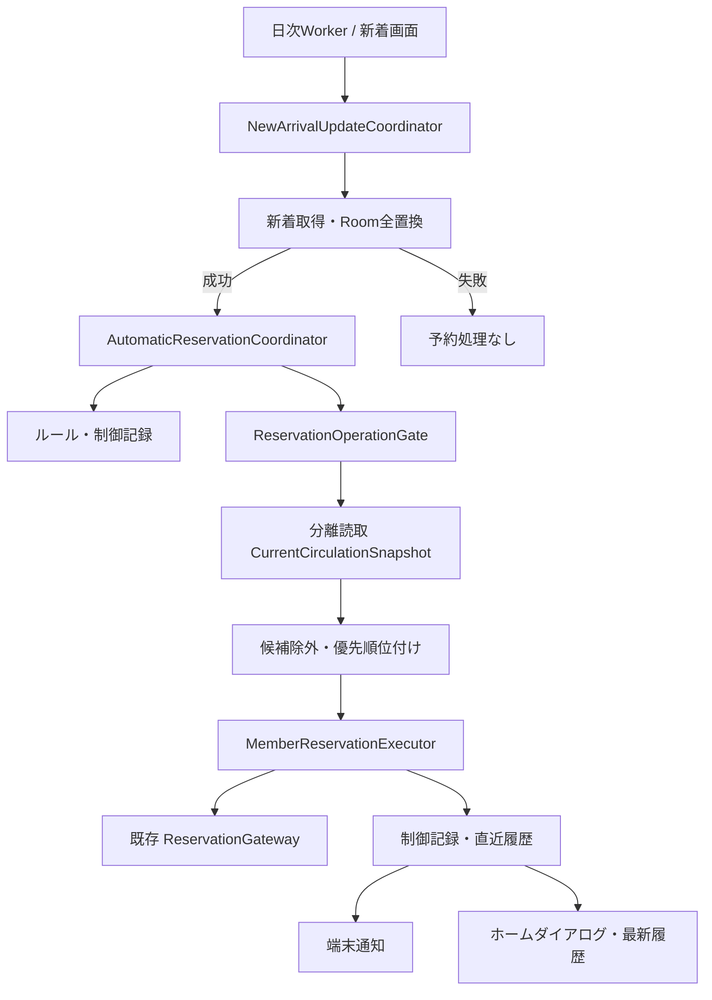

# 新着キーワード自動予約 技術設計

最終更新: 2026-07-29  
状態: 設計完了・段階1〜7完了・段階8以降未着手
機能要件の正本: `docs/spec.md` §3.11
レビュー裁定: `docs/design/new-arrival-auto-reservation-review.md`

実装状況:

- Room v8、ルールドメイン・照合、制御記録・直近履歴、送信時受取館記録を実装済み
- 通常同期の`usrrsv`までを厳密な接頭辞として共用する分離利用状況取得を実装済み
- `ReservationSubmissionResolver`の単独抽出まで実装済み。共通書込ゲート、Coordinator、
  通知・UI・Worker接続は未着手
- 段階1〜5の単体テスト471件と、実v7相当DBからv8へのRoomスキーマ検証が成功
- コミット`37c267f`のCI APKで、カート予約・即時予約とも実サイトで成立したことを
  所有者が2026-07-29に確認済み。段階7の実装へ進める
- 共通`ReservationOperationGate`を手動カート予約・即時予約・予約取消へ接続済み。
  単体テスト477件で直列化、世代増分、再認証、POST前失敗、POST後接続断、Cancellationを確認

## 1. 目的と設計原則

新着資料の取得成功後、書名がキーワードルールに一致した資料を、設定画面のメンバー順で完全自動予約する。
既存の手動予約と同じ通信安全策を再利用しつつ、手動予約の「最終確認済み」という境界と、自動予約の
「マスタースイッチとルールによる事前許可」という境界を混同しない。

次を不変条件とする。

1. 実サイトへの予約確定POSTは、1資料・1メンバー・1試行につき1回だけ送る
2. POST後に成否不明となった同一資料は、下位メンバーを含め自動再送しない
3. 自動テスト・CIから実サイトPOSTを送らない
4. 認証情報、サイトのhash、Cookie、フォーム値をDB・通知・診断ログへ保存しない
5. 新着取得、照合、予約割当、端末通知を分離し、個別にテスト可能にする
6. バックグラウンド処理の中断後も、同じ資料を無条件に再送しない
7. 手動予約・即時予約・自動予約・予約取消を共通の書込ゲートで直列化し、家族内の競合POSTを防ぐ
8. 予約用セッションには利用状況取得を挟まず、実サイトで成立確認済みの予約遷移契約を維持する

## 2. 採用案と代替案

### 2.1 採用: 更新ユースケースと自動予約オーケストレータを分離

`NewArrivalRepository`は新着資料の購読とキャッシュを担当し、新設の
`NewArrivalUpdateCoordinator`が「取得・全置換→自動予約」を1つの更新ユースケースとして実行する。
画面表示時の自動更新、既存の更新操作、日次WorkerはすべてCoordinatorを呼ぶ。

自動予約は`AutomaticReservationCoordinator`へ委譲する。Coordinatorはルール・制御記録・最新の
利用状況を読み、候補順とメンバー順を決めるが、HTMLやフォームを扱わない。

利点:

- `NewArrivalRepository.refresh()`という一見読み取り系のAPIへ、予約POSTを隠さない
- 画面・Workerのどちらから更新しても同じ経路を通せる
- 新着取得失敗時に予約処理へ進まない境界が明確になる

コスト:

- 現在`NewArrivalRepository.refresh()`を呼ぶ箇所をCoordinatorへ移行する必要がある
- 生のキャッシュ更新APIを本番UIから直接呼べないよう、可視性とDIを整理する必要がある

### 2.2 不採用: `NewArrivalRepositoryImpl.refresh()`へ自動予約を直接注入

呼出し側の変更は少ないが、キャッシュ更新が暗黙にサイト書き込みを起こす。テストでFakeを差し替えにくく、
予約側が新着DAOを読むことで依存循環も起こしやすいため不採用とする。

### 2.3 不採用: 候補×メンバーごとに既存`reserveNow()`を呼ぶ

既存コードを無変更で流用できる一方、候補ごとにログインし直すため通信が大幅に増える。
メンバーごとの認証セッションを1回確立し、複数候補へ再利用する採用案に劣る。

### 2.4 採用: 利用状況は分離読取セッションで取得

予約セッションへ貸出・予約一覧の画面遷移を挟む案は通信数を減らせるが、LICS-XPは画面遷移状態へ
依存し、成立済み予約経路へ別画面を挟んだ際の動作は未検証である。初期実装は予約セッションを変更せず、
通常同期のログインから`usrrsv`までと同じ要求列を別セッションで実行する。

通信は増えるが、実サイトで成立確認済みの予約遷移を守ることを優先する。同一セッションへの統合は、
機能成立後に別のライブ検証を経て検討する最適化とする。

### 2.5 採用: 候補単位の書込ゲート

全候補を通じて共通ゲートを保持すれば最も単純だが、候補数と家族人数に比例して手動予約・取消を
数分待たせ得る。候補1件単位で解放し、書込世代の変化時だけ利用状況を再取得する方式を採用する。

### 2.6 不採用: 直近履歴を1行JSONだけで保持

テーブル数は減るが、型制約、項目単位の互換性、Roomによる整合性検証を失う。実行概要と資料行は
親子2テーブルとし、SQL検索しない表示スナップショットだけをJSONで保持する。

### 2.7 検討済み・不採用

- 初回ON時のプレビューとアプリ独自上限: 所有者判断により設けない
- ローカル予約カート項目の自動予約除外: 自動予約の「未認知でも待ち順位を確保する」目的を優先する
- 下位ルールの飢餓対策: ルール順位を利用者の明示的優先順位として維持する
- 日次同期直後のRoomを利用状況の完全な証拠として使う最適化: 現行Roomは一覧完全性を保持しないため
  初期実装では採らない

## 3. 全体構成

主な新規境界:

- `NewArrivalUpdateCoordinator`
  - グローバル排他、新着取得、更新トリガーの記録、自動予約呼出しを担当
- `AutomaticReservationCoordinator`
  - ルール照合、除外、候補順、メンバーのフォールバック、履歴確定を担当
- `AutomaticReservationRuleRepository`
  - ルールのCRUD、並べ替え、検証を担当
- `AutomaticReservationHistoryRepository`
  - 2か月の制御記録、直近1回の表示履歴、確認済み状態を担当
- `MemberReservationExecutor`
  - 1メンバーの予約用認証セッションを保持し、予約試行を担当
- `CurrentCirculationReader`
  - 通常同期要求列の接頭辞を使う分離セッションで、貸出・予約一覧と完全性を取得
- `ReservationOperationGate`
  - 手動予約・即時予約・自動予約・予約取消を候補または利用者操作単位で直列化し、書込世代を管理
- `ReservationSubmissionResolver`
  - 現在`ReservationCartRepositoryImpl`内にある、予約応答・予約一覧照合・一度だけの再認証を共通化

## 4. Roomと設定

### 4.1 DBバージョン

`AppDatabase`をv7からv8へ上げ、`MIGRATION_7_8`を追加する。破壊的マイグレーションは使わない。

### 4.2 テーブル

| テーブル | 主キー | 用途 |
|---|---|---|
| `auto_reservation_rules` | `id` | 有効/無効と`sortOrder` |
| `auto_reservation_terms` | `ruleId, kind, sortOrder` | 含める語・除外語の原文と正規化値 |
| `auto_reservation_controls` | `tilcod` | 再送可否、最初の候補日、期限、直近状態 |
| `auto_reservation_latest_run` | 固定`id=1` | 報告対象がある直近1回の実行概要と確認済み状態 |
| `auto_reservation_latest_items` | `runId, tilcod` | 書名、ルール表示スナップショット、試行順、最終結果 |
| `reservation_pickup_submissions` | `memberId, tilcod` | アプリが送信した受取館と、成立確認済み/反映未確認の出自 |

`auto_reservation_terms.ruleId`はルール削除時にCASCADE削除する。制御記録と最新履歴は、ルールや
メンバーを削除しても説明可能である必要があるため、外部キーを張らず表示名のスナップショットを保存する。

`auto_reservation_latest_items`の一致ルールとメンバー別試行は、SQL検索に使わない直近1回の表示専用情報
なのでJSON文字列で保持する。予約判定に使う状態をJSONへ入れてはならない。

`reservation_pickup_submissions`は自動予約専用ではなく、手動カート・即時予約と共用する。
`CONFIRMED_SUBMISSION`と`UNVERIFIED_SUBMISSION`を区別し、完全な予約一覧に同じ
`memberId + tilcod`の非取消行が無い場合だけ削除する。不完全一覧の陰性を掃除根拠にしない。
`memberId`は`members`への外部キーとして削除時CASCADEにし、同期で全置換される`reservations.id`へは
紐付けない。

### 4.3 制御記録

制御状態を次の3群に分ける。

- 終端: `SUCCESS`、`ALREADY_RESERVED`、`EXCLUDED_RESERVED`、`EXCLUDED_LOANED`、
  `EXCLUDED_READ`、`REJECTED`、`UNKNOWN_AFTER_POST`
- 再試行可: `MEMBER_FALLBACK_PENDING`、`ALL_MEMBERS_LIMITED`、
  `ALL_MEMBERS_PRE_SUBMIT_FAILED`、`SETTINGS_MISSING`
- 送信境界: `PREPARED`

`PREPARED`は予約POSTの直前にRoomへ確定する。プロセス停止で結果更新まで到達しなかった場合は、
次回実行時に`UNKNOWN_AFTER_POST`へ倒し、同じ`tilcod`を自動再送しない。実際にはPOST前に停止していた
可能性もあるが、取り逃しより家族内の重複予約防止を優先する。

`PREPARED`には`preparedMemberId`を持たせるが、これは履歴・診断で停止位置を説明するためだけに使う。
再開可否、次順位選択、再送可否の制御判定へ使ってはならない。結果が明示的上限超過またはPOST前失敗に
確定したら、次メンバーの`PREPARED`を書く前に`MEMBER_FALLBACK_PENDING`へ更新する。全メンバーの
試行完了時に集約した再試行状態へ置き換える。`PREPARED`が残っていれば後続メンバーの有無にかかわらず
資料全体を`UNKNOWN_AFTER_POST`へ倒す。`MEMBER_FALLBACK_PENDING`が残った場合は次回更新で候補を
最初のメンバーから再評価できる。

`firstCandidateDate`と`expiresOn`はAsia/Tokyoの`LocalDate`で持ち、
`expiresOn = firstCandidateDate.plusMonths(2)`とする。再試行で期限を延長しない。実行開始時に
`expiresOn <= today`を削除してから候補判定する。

個別ルールOFFによる見送りは制御記録へ入れない。

### 4.4 DataStore

`AppSettings`へ`autoReservationEnabled: Boolean = false`を追加する。受取館は既存の
`defaultCalendarLibrary`の保存値を共用し、キー変更による設定消失を避ける。将来名称を整理する場合も、
DataStoreの既存キーは維持する。

通知権限・通知チャネル状態はマスタースイッチの保存条件にしない。

各runの開始時に、マスタースイッチ、ルール内容・順序、メンバーID・表示名・順序、既定館を
スナップショットとして固定する。パスワードはrun全体のスナップショットへ含めず、各メンバーの
セッション開始直前に取得する。

## 5. ルール照合

### 5.1 正規化

既存`ReadingRecordTitleNormalizer`と同じNFKC・空白除去・小文字化を共通の文字列Normalizerへ抽出する。
当面は`NewArrival.title`だけを正規化し、巻次等を連結しない。

### 5.2 保存時検証

1. 含める語は1件以上、空白だけは不可
2. 同じkind内では正規化後の完全一致を不可
3. 除外語の正規化値が、いずれかの含める語の正規化値に含まれる場合は不可
4. 含める語が除外語の部分文字列である逆方向は許可
5. 部分的に重なる含める語同士は許可

検証はUIだけでなくRepositoryのトランザクション境界でも行う。

### 5.3 候補順

1. 一致した有効ルールの最小`sortOrder`
2. `publishedYearMonth`の新しい順
3. 書名、巻次、`tilcod`の昇順

出版年月を解釈できない値は、解釈可能な値より後ろに置き、生文字列を最終タイブレークに使う。
複数の有効ルールに一致しても候補は1件に名寄せし、表示履歴には一致した全ルールを残す。

無効ルールもマスタースイッチON時は照合する。有効ルールにも一致した資料は通常候補を優先し、
OFF見送りを重ねて表示しない。

## 6. 最新利用状況の取得

### 6.1 分離読取セッション

利用状況は予約用`LicsXpReservationSession`から取得しない。`LicsXpClient.fetchUserData`の既存要求列のうち、
分離セッションの温め、ログイン、`usrlend`、`usrrsv`までを同じ順序・メソッド・パラメータで実行する
内部共通関数を抽出する。

- 通常同期: 共通前半の後、従来どおり`mybooklist`と`usrread`へ続行する
- 自動予約用: `usrrsv`の解析後に終了し、本棚・読書履歴を取得しない

自動予約用の要求列は通常同期要求列の厳密な接頭辞でなければならない。予約用セッションは
現行の成立確認済み遷移列だけを実行し、利用状況画面を一切挟まない。

通信境界は内部`CurrentCirculationGateway`として切り出し、`LicsXpClient`が実装する。
ログインから`usrrsv`までの共通関数は、通常同期用の続行に必要なセッションと解析前HTML、
自動予約用の`CurrentCirculationSnapshot`を構築できる結果を返す。公開`LibraryGateway`へ
UI向けメソッドを追加しない。

`CurrentCirculationSnapshot`は次だけを持つ。

- 最新貸出一覧
- 最新予約一覧
- 予約一覧の完全性

予約一覧の完全性は`SummaryParser`の予約数と、`ReservationState.CANCELLED`以外の解析行数が
一致した場合だけtrueとする。読書記録による除外はRoomの永続データを使う。

### 6.2 部分失敗

- 認証・通信・パース失敗したメンバーは、その回の予約先候補から外す
- 取得できたメンバーは処理を続ける
- 取得できた一覧に同じ`tilcod`の非取消行が存在すれば、完全性に関係なく家族共通の除外根拠にする
- 取消済み行しかなければ予約中の除外根拠にしない。取消済み行と非取消行が併存すれば除外する
- 一覧が不完全でも当該メンバーを予約先候補から外さない。不完全一覧の陰性は家族内の不在証明に
  使わず、同一メンバーの重複はサイトの`AlreadyReserved`で終端にする
- 事前除外用一覧の完全性とPOST後照合の完全性は別に評価する。POST後照合で陰性かつ一覧不完全なら
  拒否と断定せず`Unknown`へ倒す
- 取得失敗メンバーに同じ資料が存在しないことまでは保証できない。この場合も下位メンバーを続行する
  ことは機能要件で承認済みのトレードオフとして扱い、履歴へ取得失敗を残す
- OFFルールだけが一致した場合も、正確な見送り理由を出すため利用状況取得を行う。全メンバーの
  状況を取得できなければ「OFFのみ」を断定せず、状況取得失敗として表示する

貸出一覧はパース成功時にメンバー単位で置き換える。予約一覧は完全性を確認できた場合だけ
メンバー単位で置き換え、不完全なら既存Room予約を維持する。本棚・読書履歴は変更しない。
自動予約の成功・`AlreadyReserved`で得た結果はメモリ上のスナップショットへ反映し、
完全な予約一覧を取得できた場合はRoom表示も追随させる。

## 7. 予約実行

### 7.1 共通実行部の抽出

`ReservationCartRepositoryImpl`から次を`ReservationSubmissionResolver`へ抽出する。

- `DirectReservationAttempt`から`ReservationOutcome`への解決
- `Registered` / `StayedOnConfirmation` / POST後不明の予約一覧照合
- セッション切れがPOST前と確定した場合だけの再認証1回
- POST後不明の再送禁止
- 以降の処理へ同じセッションを使えるかの判定

手動カート・即時予約は従来どおり利用者確認後にResolverを呼ぶ。自動予約は
`AutomaticReservationCoordinator`だけが呼ぶ。公開`ReservationCartRepository`へ
「確認なし」のメソッドを追加しない。

Resolverの戻り値は、表示用`ReservationOutcome`に加えて次を持つ。

- `postBoundary`: `NOT_SENT` / `SENT_OR_UNKNOWN`
- `fallbackToNextMember`: Boolean
- `sessionReusable`: Boolean
- 照合で得た最新予約スナップショット

この抽出は自動予約の他変更と混ぜず単独コミットにする。既存ユニットテストとCIを通し、CIのAPKで
手動カート予約・即時予約の実機結果をHEAD SHA、対象、期待値、実測値とともに記録する。
実機確認が完了するまで自動予約Coordinatorへ接続しない。

### 7.2 メンバー割当

候補資料ごとに`Member.sortOrder`順で処理する。

- `Success` / `AlreadyReserved`: その資料を終了
- `RESERVATION_LIMIT_EXCEEDED`: 次順位へ進む
- POST前と確定した`AUTH` / `NETWORK` / `SESSION_EXPIRED_BEFORE_SUBMIT`: 次順位へ進む
- `INVALID_PICKUP_LIBRARY`: 共通設定の問題なので、全メンバーを試さずその資料を再試行可で終了
- `REJECTED_BY_SITE`: 次順位へ進まず終端
- `Unknown`: 次順位へ進まず終端
- サイト変更・メンテナンス: 同一原因のPOSTを広げないため、その回の残り自動予約を停止

成否不明で使用不能になったメンバーセッションは閉じる。同じ資料は下位へ送らない。別資料は、
サイト全体の変更を疑う結果でなければ、他の正常な分離セッションで続行できる。

ある資料で上限超過したメンバーも、資料区分差を考慮して次の資料では再び最上位として試す。

実行中に追加されたメンバーは開始時スナップショットに無いため次回から対象とする。セッション開始前と
各`PREPARED`・POST直前にメンバーの現存を再確認する。削除済みならPOSTせず当該メンバーの残りを停止する。
直前確認後に削除された競合窓では1件が送信され得るため、その結果は通常どおり解決して残りを停止する。

### 7.3 受取館

実行開始時に固定した設定スナップショットから、その回の全候補へ同じ既定館を使う。
連絡方法は既存実装どおりEmail固定。既定館が空、または確認画面の選択肢にない場合はPOSTしない。

### 7.4 送信時受取館の記録

手動予約・自動予約の共通結果処理で、`memberId + tilcod`単位の送信館記録を更新する。
Resolver自体へRoom依存を持たせず、Resolverの戻り値を受けたRepositoryまたはCoordinatorから記録する。

- `Success`: `CONFIRMED_SUBMISSION`
- `postBoundary=SENT_OR_UNKNOWN`の`Unknown`: `UNVERIFIED_SUBMISSION`
- `AlreadyReserved`、POST前失敗: 記録しない

表示時はサイト由来の非取消予約行と結合する。サイトが確定館を持つ場合はサイト値を優先する。
割当前でサイト値が無い場合、確認済みは「アプリ送信時の指定館」、未確認は
「アプリ送信館（この予約への反映は未確認）」と表示する。記録単独では予約行を生成しない。

## 8. 更新契機・排他・Worker

### 8.1 更新トリガー

`NewArrivalUpdateTrigger`を次の3値とする。

- `SCHEDULED`
- `SCREEN_AUTO`
- `SCREEN_MANUAL`

ルール保存やマスタースイッチ変更では呼ばない。

12時間の鮮度抑止は`SCREEN_AUTO`だけに適用する。`SCHEDULED`と`SCREEN_MANUAL`は鮮度に関係なく
新着取得を行う。取得成功・Room全置換成功時だけ評価し、取得失敗または鮮度抑止による取得省略では
評価しない。

### 8.2 排他

`NewArrivalUpdateCoordinator`をSingletonとし、1個の`Mutex.tryLock()`で
「新着取得→自動予約完了」全体を排他する。二重呼出しは待機列へ積まず`AlreadyRunning`を返す。
画面側のローカルMutexは表示状態の保護に限定する。このMutexは自動更新同士の排他であり、
手動予約・取消との排他は次節の共通書込ゲートが担当する。

### 8.3 共通書込ゲートと世代

`ReservationOperationGate`をSingletonとし、手動カート予約、即時予約、自動予約、予約取消で共用する。
内部に単調増加する書込世代を持つ。ロック順は全経路で
`ReservationOperationGate`→`RequestRateLimiter`に統一する。

自動予約は候補1件ごとにゲートを取得する。最初の候補ではゲート内で全メンバーの利用状況を取得し、
同じ`tilcod`の全メンバーフォールバックと制御記録確定まで完了してから解放する。候補完了時の世代を
次候補へ引き継ぐ。

次候補で世代が同じなら、直前の自動予約結果を反映したメモリ上のスナップショットを再利用する。
世代が変わっていれば別の書込が割り込んだため、判定前に全メンバーの利用状況を取得し直す。
ゲート取得前に得たスナップショットを、待機後の判定へ使ってはならない。

予約・取消の送信直前、必要な永続状態を確定した後に、ゲート内で世代を加算してからPOSTする。
成功・既知拒否・成否不明にかかわらず、送信を開始し得る境界で先に加算する。加算後にプロセスが
停止して実際には送信されなかった場合も、余分な再取得が起きるだけなので安全側である。
自動予約自身は候補完了時の世代を次候補の比較基準に更新するため、割込みが無い通常時に
毎候補再取得しない。フォーム検証や認証などPOST前と確定した失敗は加算しない。

### 8.4 日次同期

自動予約ONの場合だけ、既存日次Workerへ新着更新を追加する。実行順は次とする。

1. 既存`StatusRepository.syncAll(SCHEDULED)`
2. `NewArrivalUpdateCoordinator.refresh(SCHEDULED)`

自動予約側は候補がある場合に専用の最新利用状況取得を行うため、1の部分失敗だけで自動予約全体を
止めない。自動予約OFFなら日次Workerは従来どおり利用状況同期だけを行う。

予約候補について`PREPARED`を永続化した後は、Workerの同一実行を`Result.retry()`で再実行しない。
上限超過・POST前失敗も「次回の新着更新」で再試行し、WorkManagerの短時間再試行では送らない。
新着取得自体が失敗し、予約候補を1件も準備していない場合だけ既存の再試行規則を適用できる。
Workerの最終判定は同期結果だけでなく、自動予約が`PREPARED`へ到達したかを入力に含める。

## 9. 最新履歴・ホーム・通知

### 9.1 直近履歴

報告対象がある実行だけを、Roomトランザクションで直近履歴へ全置換する。報告対象は次である。

- 成功・予約済み
- 全員上限超過
- 認証/通信/パース/メンテナンス
- 明確な拒否・成否不明
- 設定不足
- 個別ルールOFFによる見送り

一致なし、予約中・貸出中・読書記録・制御記録による正常除外だけの実行では上書きしない。

### 9.2 ホーム

`HomeScreenController`は最新履歴Flowを既存の`combine`へ加える。ホームには最終試行日時・概要と
「最新履歴を見る」を表示する。未確認の完了履歴を受け取ったときの動作は次のとおり。

- ホーム表示中: その場で詳細ダイアログ
- 他画面表示中: 割り込まず、次にホームへ来たとき
- ダイアログの閉じる/予約一覧/最新履歴のいずれかで確認済みにする

最新履歴画面とダイアログに取消ボタンは置かない。「予約一覧を見る」で既存の取消導線へ移動する。

### 9.3 Android通知

自動予約処理を行った完了履歴について、専用チャネル`auto_reservation`から通知を1件出す。
書名・メンバー名・ルール名は含めず、「確保済みN件／見送りN件／エラーN件」の集計だけを出す。

- 確保済み: `Success`、`AlreadyReserved`
- 見送り: 全メンバー上限超過、設定不足、個別ルールOFF
- エラー: 認証・通信・パース・メンテナンス、サイト拒否、POST後不明

正常除外は件数へ含めず、OFFルールだけの見送りでは通知しない。ホームの詳細では`Success`、
`AlreadyReserved`、POST後不明を独立表示する。通知分類は表示専用であり、制御状態へ使わない。

`PendingIntent`は`MainActivity`を開き、専用actionでホーム遷移を要求する。
`onCreate`と`onNewIntent`の両方を扱い、アプリ起動中に通知をタップした場合もホームへ戻す。
`LibraryApp`の現在画面はActivityから渡す一回限りのナビゲーションコマンドで`HOME`へ変更する。

通知権限拒否、全通知OFF、チャネルOFFで送信できなくても、自動予約結果を巻き戻さず機能もOFFにしない。

## 10. 設定UI

設定画面へ次を追加する。

- マスタースイッチ（初期OFF）
- 「詳細」ボタンと機能説明ダイアログ
- 優先順のルール一覧、個別スイッチ、ドラッグ並べ替え
- 追加・編集画面の含める語/除外語タグ
- 削除確認
- 設定不足メッセージ

詳細説明には、日次更新、画面表示時の自動更新、新着画面の「更新」が自動予約を起こすことを含める。
新着画面はマスターON時に「更新後に自動予約を判定する」旨を常設表示し、
「新着資料を更新中」と「自動予約を判定・実行中」を別の状態として表示する。
専用実行ボタンや更新ごとの確認ダイアログは追加しない。

手動予約・取消が共通書込ゲートを待っている場合は「自動予約処理の完了待ち」等を表示し、
無反応に見せない。自動予約は候補単位でゲートを解放するため、全候補完了までは待たせない。

マスターをOFFからONへ変える時点で、有効ルール1件以上、メンバー1人以上、既定館を検証する。
ON後に不足しても暗黙にOFFへしない。最後の有効ルールを無効化した場合は設定画面へ警告を出すだけで、
新着更新時の照合を行わない。

設定変更は次回更新から反映し、変更時点では新着取得も予約も行わない。

## 11. エラー処理と診断

- 診断ログにはrun ID、trigger、件数、メンバーID、`tilcod`、結果分類だけを記録できる
- 書名、キーワード原文、カード番号、パスワード、Cookie、hash、フォーム本文、サイトの個人情報は記録しない
- 端末表示用のサイトメッセージは最新履歴に必要最小限だけ保存し、認証情報が混ざらない既知メッセージに限る
- 予期しない例外は資料単位またはメンバー単位で分類し、POST境界が不明なら必ず`Unknown`へ倒す
- 通知失敗は予約結果を変更しない

## 12. 実装順序

1. v7→v8マイグレーション、Entity、DAO、DataStoreキー、送信館記録
2. ルールドメイン・Normalizer・保存時検証・純粋Matcher
3. 制御記録と直近履歴Repository
4. 通常同期の接頭辞を使う分離利用状況取得
5. `ReservationSubmissionResolver`抽出だけを単独コミット
6. 段階5のユニットテスト・CI・カート予約/即時予約の実機確認
7. `ReservationOperationGate`を手動予約・即時予約・取消へ接続
8. `AutomaticReservationCoordinator`
9. `NewArrivalUpdateCoordinator`と画面・日次Workerの呼出し置換
10. Android通知とホームナビゲーション
11. 設定・新着状態表示・ホームダイアログ・最新履歴UI
12. 全体回帰試験

段階5は実サイト検証済みの手動予約ロジックへ影響するため、他の機能変更と混ぜない。
段階6が完了するまで自動予約側へResolverを接続しない。

## 13. テスト

### 13.1 純粋ロジック

- 書名だけを照合し巻次等を見ない
- NFKC・空白・大文字小文字
- 含める語AND、除外語
- 含める語/除外語の方向付き包含検証
- 複数ルール一致、無効ルール、候補順、出版年月不正値
- 2か月期限（末日・うるう年・月またぎ）

### 13.2 Room

- `MIGRATION_7_8`
- ルール削除のCASCADE
- 並べ替えの一意性
- 制御記録の期限削除
- 直近履歴の全置換と確認済み更新
- ルール/メンバー削除後も表示スナップショットが残る
- `PREPARED`の`preparedMemberId`に関係なく`UNKNOWN_AFTER_POST`へ遷移する
- `MEMBER_FALLBACK_PENDING`残存時は次回更新で最初のメンバーから安全に再評価できる
- 送信館記録の2出自、完全一覧だけを根拠とする掃除、同期後も記録が残ること

### 13.3 Coordinator

- 新着取得失敗で自動予約を呼ばない
- マスターOFF、有効ルール0件、一致なし
- 家族内予約/貸出/読書記録/制御記録の除外
- 取消済み行だけなら候補に残り、非取消行が併存すれば除外されること
- 不完全一覧のメンバーを予約先候補に残し、事前陰性を不在証明に使わないこと
- 上限超過で次メンバー、次資料では優先順をリセット
- POST前認証/通信失敗で次メンバー
- 拒否・Unknownで同一資料を次メンバーへ送らない
- 設定不足、OFFルール見送り
- `PREPARED`残存を自動再送しない
- 同時更新を1回に抑止
- 候補間の世代不変で利用状況を再取得せず、手動書込で世代が変われば再取得する
- メンバー追加は次回から、削除済みメンバーはPOST直前確認で停止する
- `SCREEN_AUTO`だけ鮮度抑止し、`SCHEDULED`・`SCREEN_MANUAL`は常に取得する
- 通知失敗でも結果を確定

### 13.4 通信・回帰

- 自動予約用利用状況の要求列が通常同期の`usrrsv`までの厳密な接頭辞であり、
  `mybooklist`・`usrread`へ進まないこと
- MockWebServerで、メンバーごとの予約ログインが1回で複数資料へ再利用されること
- リクエスト間500msの既存制御を維持すること
- POST後切断でも同一資料の確定POSTが1回だけであること
- 手動予約・自動予約・取消が共通ゲートを通り、ロック順が逆転しないこと
- 手動カート・即時予約の既存結果分類と通信順がResolver抽出前後で変わらないこと
- CIではライブ診断タスクを実行しないこと

### 13.5 UI

- マスターONの前提条件
- タグ検証、個別OFF、並べ替え
- ホーム表示中/別画面/通知タップのダイアログ
- 確認済み後に再表示しないこと
- 最新履歴から予約一覧へ移動すること
- 通知の確保済み/見送り/エラー件数が結果分類と一致し、個人情報を含まないこと
- 新着画面の更新中/自動予約中表示と、共通ゲート待機中の手動操作表示
- 送信館の確認済み/反映未確認文言、サイト確定館の優先

## 14. 受入条件

- `docs/spec.md` §3.11の結果分類・遷移規則をFake Gatewayで網羅する
- 既存手動予約・予約取消の全ユニットテストが回帰しない
- `:app:testDebugUnitTest`と`:app:assembleDebug`が成功する
- 実機で、マスターOFFではPOSTされないこと、OFFルール見送り、メンバー上限フォールバック、
  確保済み通知→ホーム→詳細→予約一覧の導線を確認する
- Resolver抽出コミットのCI APKで、カート予約と即時予約の通信結果が抽出前と変わらないことを
  自動予約接続前に確認する
- 実サイトを使う試験は、対象資料と副作用を所有者が明示承認した手動診断だけで行う

## 15. 既知のリスク

- 取得失敗メンバーの予約状況は確認できないため、下位メンバーで家族内重複が起こる可能性は残る。
  これは「認証等のPOST前失敗なら次順位へ進む」という承認済み要件とのトレードオフである
- 不完全一覧のメンバーも予約先候補に使うため、別の不完全メンバーに隠れた予約との家族内重複が
  起こる可能性は残る。同一メンバーの重複は`AlreadyReserved`で解決する
- 読書記録はRoomの最終成功同期時点であり、画面経路では直近の読了を含まない可能性がある。
  日次同期も部分失敗メンバーの完全な最新性は保証しない
- サイトの新着資料に入荷日は無いため、出版年月を代理順位に使う
- OSによって日次Workerは設定時刻から遅延し得る
- POST直前の永続化とネットワーク送信を原子的にはできない。`PREPARED`残存をUnknownとして
  再送しないことで、取り逃しを許容して重複予約を防ぐ
- 候補単位ゲートでも、1候補内の複数メンバーフォールバックと照合中は手動操作を待たせる
- メンバー現存確認とPOSTを原子的にできないため、確認直後の削除では1件が送信され得る
- 外部ブラウザからの予約・取消はアプリの書込世代へ反映できず、最終的にはサイト応答と照合で解決する
- サイト応答変更時は、既存の予約安全策どおりUnknownまたはサイト変更として停止する
