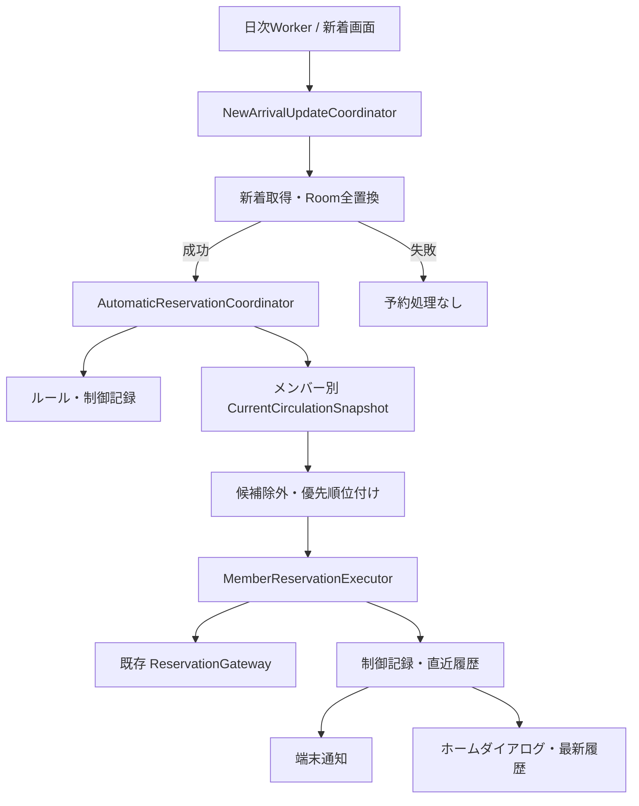

# 新着キーワード自動予約 技術設計

最終更新: 2026-07-29  
状態: 設計完了・実装未着手  
機能要件の正本: `docs/spec.md` §3.11

## 1. 目的と設計原則

新着資料の取得成功後、書名がキーワードルールに一致した資料を、設定画面のメンバー順で完全自動予約する。
既存の手動予約と同じ通信安全策を再利用しつつ、手動予約の「最終確認済み」という境界と、自動予約の
「マスタースイッチとルールによる事前許可」という境界を混同しない。

次を不変条件とする。

1. 実サイトへの予約確定POSTは、1資料・1メンバー・1試行につき1回だけ送る
2. POST後に成否不明となった同一資料は、下位メンバーを含め自動再送しない
3. 自動テスト・CIから実サイトPOSTを送らない
4. 認証情報、サイトのhash、Cookie、フォーム値をDB・通知・診断ログへ保存しない
5. 新着取得、照合、予約割当、端末通知を分離し、個別にテスト可能にする
6. バックグラウンド処理の中断後も、同じ資料を無条件に再送しない

## 2. 採用案と代替案

### 2.1 採用: 更新ユースケースと自動予約オーケストレータを分離

`NewArrivalRepository`は新着資料の購読とキャッシュを担当し、新設の
`NewArrivalUpdateCoordinator`が「取得・全置換→自動予約」を1つの更新ユースケースとして実行する。
画面表示時の自動更新、既存の更新操作、日次WorkerはすべてCoordinatorを呼ぶ。

自動予約は`AutomaticReservationCoordinator`へ委譲する。Coordinatorはルール・制御記録・最新の
利用状況を読み、候補順とメンバー順を決めるが、HTMLやフォームを扱わない。

利点:

- `NewArrivalRepository.refresh()`という一見読み取り系のAPIへ、予約POSTを隠さない
- 画面・Workerのどちらから更新しても同じ経路を通せる
- 新着取得失敗時に予約処理へ進まない境界が明確になる

コスト:

- 現在`NewArrivalRepository.refresh()`を呼ぶ箇所をCoordinatorへ移行する必要がある
- 生のキャッシュ更新APIを本番UIから直接呼べないよう、可視性とDIを整理する必要がある

### 2.2 不採用: `NewArrivalRepositoryImpl.refresh()`へ自動予約を直接注入

呼出し側の変更は少ないが、キャッシュ更新が暗黙にサイト書き込みを起こす。テストでFakeを差し替えにくく、
予約側が新着DAOを読むことで依存循環も起こしやすいため不採用とする。

### 2.3 不採用: 候補×メンバーごとに既存`reserveNow()`を呼ぶ

既存コードを無変更で流用できる一方、候補ごとにログインし直すため通信が大幅に増える。
メンバーごとの認証セッションを1回確立し、複数候補へ再利用する採用案に劣る。

## 3. 全体構成

主な新規境界:

- `NewArrivalUpdateCoordinator`
  - グローバル排他、新着取得、更新トリガーの記録、自動予約呼出しを担当
- `AutomaticReservationCoordinator`
  - ルール照合、除外、候補順、メンバーのフォールバック、履歴確定を担当
- `AutomaticReservationRuleRepository`
  - ルールのCRUD、並べ替え、検証を担当
- `AutomaticReservationHistoryRepository`
  - 2か月の制御記録、直近1回の表示履歴、確認済み状態を担当
- `MemberReservationExecutor`
  - 1メンバーの認証セッションを保持し、利用状況取得と予約試行を担当
- `ReservationSubmissionResolver`
  - 現在`ReservationCartRepositoryImpl`内にある、予約応答・予約一覧照合・一度だけの再認証を共通化

## 4. Roomと設定

### 4.1 DBバージョン

`AppDatabase`をv7からv8へ上げ、`MIGRATION_7_8`を追加する。破壊的マイグレーションは使わない。

### 4.2 テーブル

| テーブル | 主キー | 用途 |
|---|---|---|
| `auto_reservation_rules` | `id` | 有効/無効と`sortOrder` |
| `auto_reservation_terms` | `ruleId, kind, sortOrder` | 含める語・除外語の原文と正規化値 |
| `auto_reservation_controls` | `tilcod` | 再送可否、最初の候補日、期限、直近状態 |
| `auto_reservation_latest_run` | 固定`id=1` | 報告対象がある直近1回の実行概要と確認済み状態 |
| `auto_reservation_latest_items` | `runId, tilcod` | 書名、ルール表示スナップショット、試行順、最終結果 |

`auto_reservation_terms.ruleId`はルール削除時にCASCADE削除する。制御記録と最新履歴は、ルールや
メンバーを削除しても説明可能である必要があるため、外部キーを張らず表示名のスナップショットを保存する。

`auto_reservation_latest_items`の一致ルールとメンバー別試行は、SQL検索に使わない直近1回の表示専用情報
なのでJSON文字列で保持する。予約判定に使う状態をJSONへ入れてはならない。

### 4.3 制御記録

制御状態を次の3群に分ける。

- 終端: `SUCCESS`、`ALREADY_RESERVED`、`EXCLUDED_RESERVED`、`EXCLUDED_LOANED`、
  `EXCLUDED_READ`、`REJECTED`、`UNKNOWN_AFTER_POST`
- 再試行可: `ALL_MEMBERS_LIMITED`、`ALL_MEMBERS_PRE_SUBMIT_FAILED`、`SETTINGS_MISSING`
- 送信境界: `PREPARED`

`PREPARED`は予約POSTの直前にRoomへ確定する。プロセス停止で結果更新まで到達しなかった場合は、
次回実行時に`UNKNOWN_AFTER_POST`へ倒し、同じ`tilcod`を自動再送しない。実際にはPOST前に停止していた
可能性もあるが、取り逃しより家族内の重複予約防止を優先する。

`firstCandidateDate`と`expiresOn`はAsia/Tokyoの`LocalDate`で持ち、
`expiresOn = firstCandidateDate.plusMonths(2)`とする。再試行で期限を延長しない。実行開始時に
`expiresOn <= today`を削除してから候補判定する。

個別ルールOFFによる見送りは制御記録へ入れない。

### 4.4 DataStore

`AppSettings`へ`autoReservationEnabled: Boolean = false`を追加する。受取館は既存の
`defaultCalendarLibrary`の保存値を共用し、キー変更による設定消失を避ける。将来名称を整理する場合も、
DataStoreの既存キーは維持する。

通知権限・通知チャネル状態はマスタースイッチの保存条件にしない。

## 5. ルール照合

### 5.1 正規化

既存`ReadingRecordTitleNormalizer`と同じNFKC・空白除去・小文字化を共通の文字列Normalizerへ抽出する。
当面は`NewArrival.title`だけを正規化し、巻次等を連結しない。

### 5.2 保存時検証

1. 含める語は1件以上、空白だけは不可
2. 同じkind内では正規化後の完全一致を不可
3. 除外語の正規化値が、いずれかの含める語の正規化値に含まれる場合は不可
4. 含める語が除外語の部分文字列である逆方向は許可
5. 部分的に重なる含める語同士は許可

検証はUIだけでなくRepositoryのトランザクション境界でも行う。

### 5.3 候補順

1. 一致した有効ルールの最小`sortOrder`
2. `publishedYearMonth`の新しい順
3. 書名、巻次、`tilcod`の昇順

出版年月を解釈できない値は、解釈可能な値より後ろに置き、生文字列を最終タイブレークに使う。
複数の有効ルールに一致しても候補は1件に名寄せし、表示履歴には一致した全ルールを残す。

無効ルールもマスタースイッチON時は照合する。有効ルールにも一致した資料は通常候補を優先し、
OFF見送りを重ねて表示しない。

## 6. 最新利用状況の取得

### 6.1 認証セッションの再利用

`LicsXpReservationSession`に内部能力`CurrentCirculationSnapshotSource`を実装する。
既存の公開`ReservationSession`へ必須メソッドを増やさず、手動予約用Fakeを破壊しない。

`CurrentCirculationSnapshot`は次だけを持つ。

- 最新貸出一覧
- 最新予約一覧
- 予約一覧の完全性

マイ本棚・読書履歴は取得しない。読書記録はRoomの永続データを使う。同じ認証セッションを、その後の
予約確定にも再利用する。

この「予約用ログインセッションで貸出・予約一覧を読んだ後、そのまま直接予約へ進む」遷移列は
実サイト未検証である。実装時はまず読み取りだけのライブ診断で画面遷移を確認する。遷移によって
直接予約が成立しない場合は、最新利用状況だけを別の分離読取セッションで取得し、予約用セッションは
既存の成立済み遷移列のまま保持する。通信増加は許容するが、古いローカル情報だけで代用してはならない。

### 6.2 部分失敗

- 認証・通信・パース失敗したメンバーは、その回の予約先候補から外す
- 取得できたメンバーは処理を続ける
- 取得できた一覧に同じ`tilcod`が存在すれば家族共通の除外根拠にする
- 取得失敗メンバーに同じ資料が存在しないことまでは保証できない。この場合も下位メンバーを続行する
  ことは機能要件で承認済みのトレードオフとして扱い、履歴へ取得失敗を残す
- OFFルールだけが一致した場合も、正確な見送り理由を出すため利用状況取得を行う。全メンバーの
  状況を取得できなければ「OFFのみ」を断定せず、状況取得失敗として表示する

完全に取得できたメンバーの貸出・予約スナップショットはRoomへ反映し、ホーム・予約一覧の表示も
自動予約後の状態へ追随させる。予約一覧が不完全な場合は既存DBを全置換しない。

## 7. 予約実行

### 7.1 共通実行部の抽出

`ReservationCartRepositoryImpl`から次を`ReservationSubmissionResolver`へ抽出する。

- `DirectReservationAttempt`から`ReservationOutcome`への解決
- `Registered` / `StayedOnConfirmation` / POST後不明の予約一覧照合
- セッション切れがPOST前と確定した場合だけの再認証1回
- POST後不明の再送禁止
- 以降の処理へ同じセッションを使えるかの判定

手動カート・即時予約は従来どおり利用者確認後にResolverを呼ぶ。自動予約は
`AutomaticReservationCoordinator`だけが呼ぶ。公開`ReservationCartRepository`へ
「確認なし」のメソッドを追加しない。

Resolverの戻り値は、表示用`ReservationOutcome`に加えて次を持つ。

- `postBoundary`: `NOT_SENT` / `SENT_OR_UNKNOWN`
- `fallbackToNextMember`: Boolean
- `sessionReusable`: Boolean
- 照合で得た最新予約スナップショット

### 7.2 メンバー割当

候補資料ごとに`Member.sortOrder`順で処理する。

- `Success` / `AlreadyReserved`: その資料を終了
- `RESERVATION_LIMIT_EXCEEDED`: 次順位へ進む
- POST前と確定した`AUTH` / `NETWORK` / `SESSION_EXPIRED_BEFORE_SUBMIT`: 次順位へ進む
- `INVALID_PICKUP_LIBRARY`: 共通設定の問題なので、全メンバーを試さずその資料を再試行可で終了
- `REJECTED_BY_SITE`: 次順位へ進まず終端
- `Unknown`: 次順位へ進まず終端
- サイト変更・メンテナンス: 同一原因のPOSTを広げないため、その回の残り自動予約を停止

成否不明で使用不能になったメンバーセッションは閉じる。同じ資料は下位へ送らない。別資料は、
サイト全体の変更を疑う結果でなければ、他の正常な分離セッションで続行できる。

ある資料で上限超過したメンバーも、資料区分差を考慮して次の資料では再び最上位として試す。

### 7.3 受取館

実行開始時に`AppSettings`をスナップショットし、その回の全候補へ同じ既定館を使う。
連絡方法は既存実装どおりEmail固定。既定館が空、または確認画面の選択肢にない場合はPOSTしない。

## 8. 更新契機・排他・Worker

### 8.1 更新トリガー

`NewArrivalUpdateTrigger`を次の3値とする。

- `SCHEDULED`
- `SCREEN_AUTO`
- `SCREEN_MANUAL`

ルール保存やマスタースイッチ変更では呼ばない。

### 8.2 排他

`NewArrivalUpdateCoordinator`をSingletonとし、1個の`Mutex.tryLock()`で
「新着取得→自動予約完了」全体を排他する。二重呼出しは待機列へ積まず`AlreadyRunning`を返す。
画面側のローカルMutexは表示状態の保護に限定し、実処理の唯一の排他はCoordinatorとする。

### 8.3 日次同期

自動予約ONの場合だけ、既存日次Workerへ新着更新を追加する。実行順は次とする。

1. 既存`StatusRepository.syncAll(SCHEDULED)`
2. `NewArrivalUpdateCoordinator.refresh(SCHEDULED)`

自動予約側は候補がある場合に専用の最新利用状況取得を行うため、1の部分失敗だけで自動予約全体を
止めない。自動予約OFFなら日次Workerは従来どおり利用状況同期だけを行う。

予約候補について`PREPARED`を永続化した後は、Workerの同一実行を`Result.retry()`で再実行しない。
上限超過・POST前失敗も「次回の新着更新」で再試行し、WorkManagerの短時間再試行では送らない。
新着取得自体が失敗し、予約候補を1件も準備していない場合だけ既存の再試行規則を適用できる。

## 9. 最新履歴・ホーム・通知

### 9.1 直近履歴

報告対象がある実行だけを、Roomトランザクションで直近履歴へ全置換する。報告対象は次である。

- 成功・予約済み
- 全員上限超過
- 認証/通信/パース/メンテナンス
- 明確な拒否・成否不明
- 設定不足
- 個別ルールOFFによる見送り

一致なし、予約中・貸出中・読書記録・制御記録による正常除外だけの実行では上書きしない。

### 9.2 ホーム

`HomeScreenController`は最新履歴Flowを既存の`combine`へ加える。ホームには最終試行日時・概要と
「最新履歴を見る」を表示する。未確認の完了履歴を受け取ったときの動作は次のとおり。

- ホーム表示中: その場で詳細ダイアログ
- 他画面表示中: 割り込まず、次にホームへ来たとき
- ダイアログの閉じる/予約一覧/最新履歴のいずれかで確認済みにする

最新履歴画面とダイアログに取消ボタンは置かない。「予約一覧を見る」で既存の取消導線へ移動する。

### 9.3 Android通知

自動予約処理を行った完了履歴について、専用チャネル`auto_reservation`から固定文言の通知を1件出す。
書名・メンバー・成否は通知へ含めない。OFFルールだけの見送りでは出さない。

`PendingIntent`は`MainActivity`を開き、専用actionでホーム遷移を要求する。
`onCreate`と`onNewIntent`の両方を扱い、アプリ起動中に通知をタップした場合もホームへ戻す。
`LibraryApp`の現在画面はActivityから渡す一回限りのナビゲーションコマンドで`HOME`へ変更する。

通知権限拒否、全通知OFF、チャネルOFFで送信できなくても、自動予約結果を巻き戻さず機能もOFFにしない。

## 10. 設定UI

設定画面へ次を追加する。

- マスタースイッチ（初期OFF）
- 「詳細」ボタンと機能説明ダイアログ
- 優先順のルール一覧、個別スイッチ、ドラッグ並べ替え
- 追加・編集画面の含める語/除外語タグ
- 削除確認
- 設定不足メッセージ

マスターをOFFからONへ変える時点で、有効ルール1件以上、メンバー1人以上、既定館を検証する。
ON後に不足しても暗黙にOFFへしない。最後の有効ルールを無効化した場合は設定画面へ警告を出すだけで、
新着更新時の照合を行わない。

設定変更は次回更新から反映し、変更時点では新着取得も予約も行わない。

## 11. エラー処理と診断

- 診断ログにはrun ID、trigger、件数、メンバーID、`tilcod`、結果分類だけを記録できる
- 書名、キーワード原文、カード番号、パスワード、Cookie、hash、フォーム本文、サイトの個人情報は記録しない
- 端末表示用のサイトメッセージは最新履歴に必要最小限だけ保存し、認証情報が混ざらない既知メッセージに限る
- 予期しない例外は資料単位またはメンバー単位で分類し、POST境界が不明なら必ず`Unknown`へ倒す
- 通知失敗は予約結果を変更しない

## 12. 実装順序

1. v7→v8マイグレーション、Entity、DAO、DataStoreキー
2. ルールドメイン・Normalizer・保存時検証・純粋Matcher
3. 制御記録と直近履歴Repository
4. `CurrentCirculationSnapshotSource`と利用状況取得
5. `ReservationSubmissionResolver`抽出（手動予約の既存テストを維持）
6. `AutomaticReservationCoordinator`
7. `NewArrivalUpdateCoordinator`と画面・日次Workerの呼出し置換
8. Android通知とホームナビゲーション
9. 設定・ホームダイアログ・最新履歴UI
10. 全体回帰試験

段階5は既存の手動予約へ影響するため、抽出前後で既存テスト結果が同一であることを確認してから
自動予約側を接続する。

## 13. テスト

### 13.1 純粋ロジック

- 書名だけを照合し巻次等を見ない
- NFKC・空白・大文字小文字
- 含める語AND、除外語
- 含める語/除外語の方向付き包含検証
- 複数ルール一致、無効ルール、候補順、出版年月不正値
- 2か月期限（末日・うるう年・月またぎ）

### 13.2 Room

- `MIGRATION_7_8`
- ルール削除のCASCADE
- 並べ替えの一意性
- 制御記録の期限削除
- 直近履歴の全置換と確認済み更新
- ルール/メンバー削除後も表示スナップショットが残る

### 13.3 Coordinator

- 新着取得失敗で自動予約を呼ばない
- マスターOFF、有効ルール0件、一致なし
- 家族内予約/貸出/読書記録/制御記録の除外
- 上限超過で次メンバー、次資料では優先順をリセット
- POST前認証/通信失敗で次メンバー
- 拒否・Unknownで同一資料を次メンバーへ送らない
- 設定不足、OFFルール見送り
- `PREPARED`残存を自動再送しない
- 同時更新を1回に抑止
- 通知失敗でも結果を確定

### 13.4 通信・回帰

- MockWebServerで、メンバーごとのログインが1回で複数資料へ再利用されること
- リクエスト間500msの既存制御を維持すること
- POST後切断でも同一資料の確定POSTが1回だけであること
- 手動カート・即時予約の既存結果分類と通信順がResolver抽出前後で変わらないこと
- CIではライブ診断タスクを実行しないこと

### 13.5 UI

- マスターONの前提条件
- タグ検証、個別OFF、並べ替え
- ホーム表示中/別画面/通知タップのダイアログ
- 確認済み後に再表示しないこと
- 最新履歴から予約一覧へ移動すること
- 通知本文に書名・メンバー・成否が含まれないこと

## 14. 受入条件

- `docs/spec.md` §3.11の結果マトリクスをFake Gatewayで網羅する
- 既存手動予約・予約取消の全ユニットテストが回帰しない
- `:app:testDebugUnitTest`と`:app:assembleDebug`が成功する
- 実機で、マスターOFFではPOSTされないこと、OFFルール見送り、メンバー上限フォールバック、
  成功通知→ホーム→詳細→予約一覧の導線を確認する
- 実サイトを使う試験は、対象資料と副作用を所有者が明示承認した手動診断だけで行う

## 15. 既知のリスク

- 取得失敗メンバーの予約状況は確認できないため、下位メンバーで家族内重複が起こる可能性は残る。
  これは「認証等のPOST前失敗なら次順位へ進む」という承認済み要件とのトレードオフである
- サイトの新着資料に入荷日は無いため、出版年月を代理順位に使う
- OSによって日次Workerは設定時刻から遅延し得る
- POST直前の永続化とネットワーク送信を原子的にはできない。`PREPARED`残存をUnknownとして
  再送しないことで、取り逃しを許容して重複予約を防ぐ
- 予約用ログインセッションから利用状況を読んだ後も直接予約が成立するかは未検証である。
  読み取りライブ診断で確認し、成立済みの予約遷移列を崩す場合は利用状況取得を別セッションへ分ける
- サイト応答変更時は、既存の予約安全策どおりUnknownまたはサイト変更として停止する
